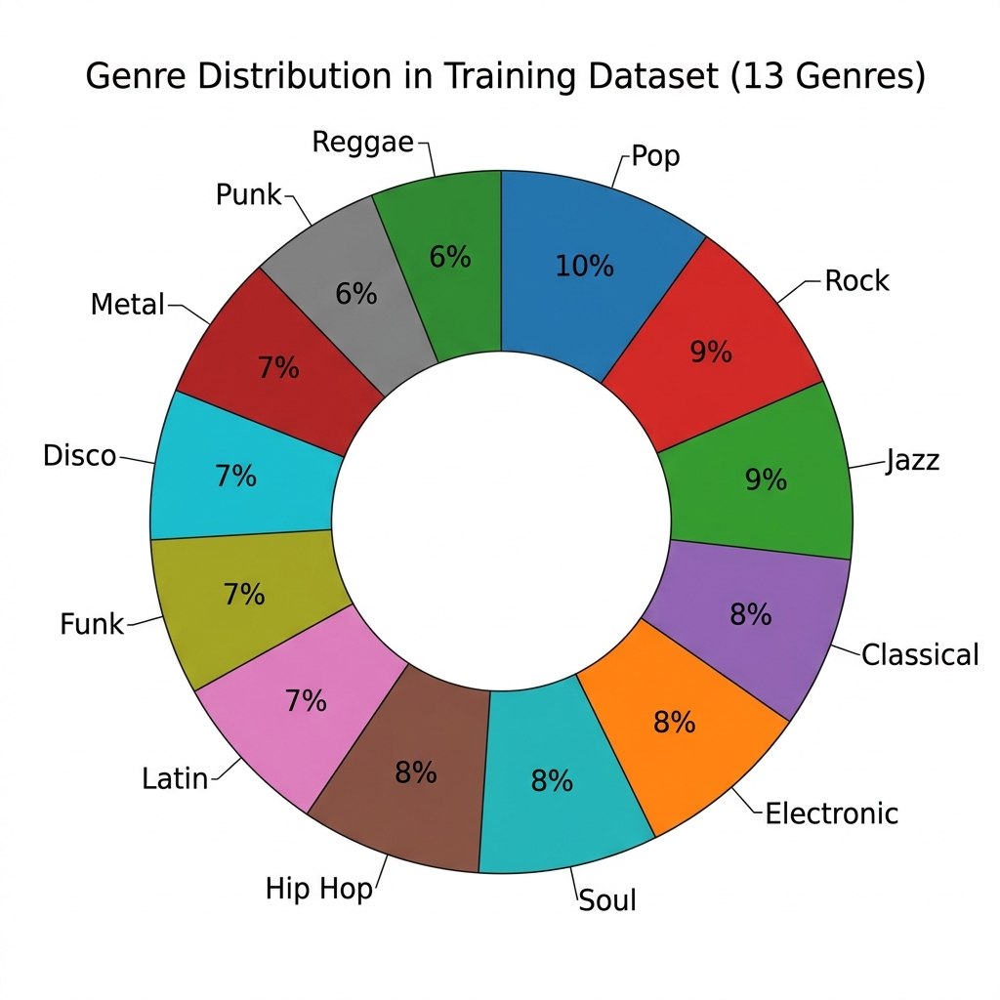
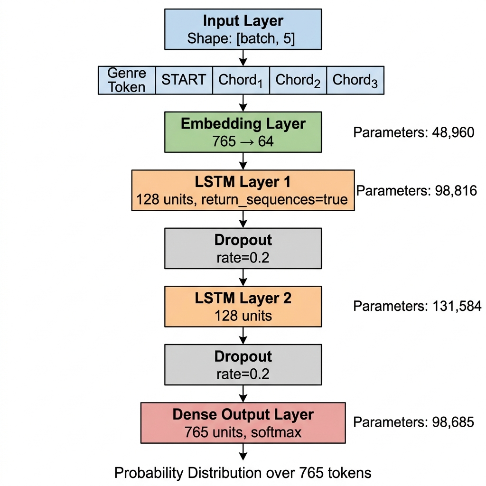
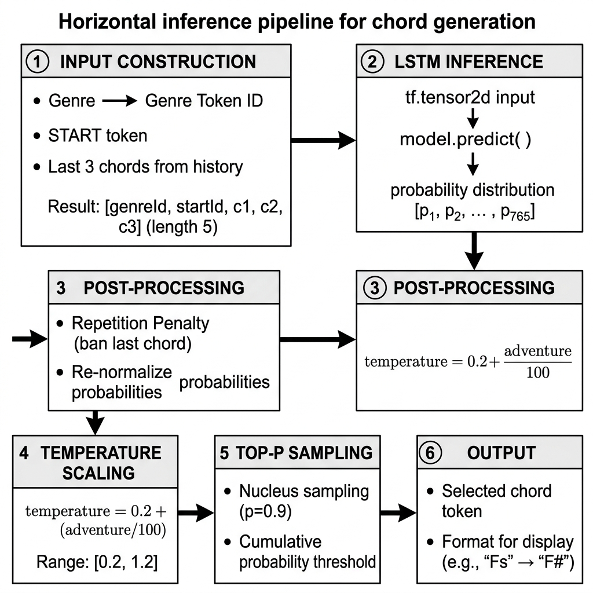
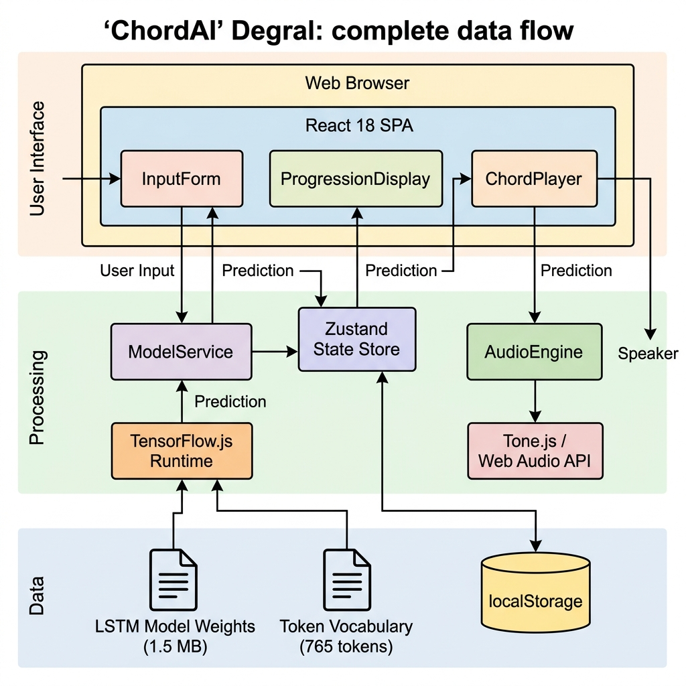
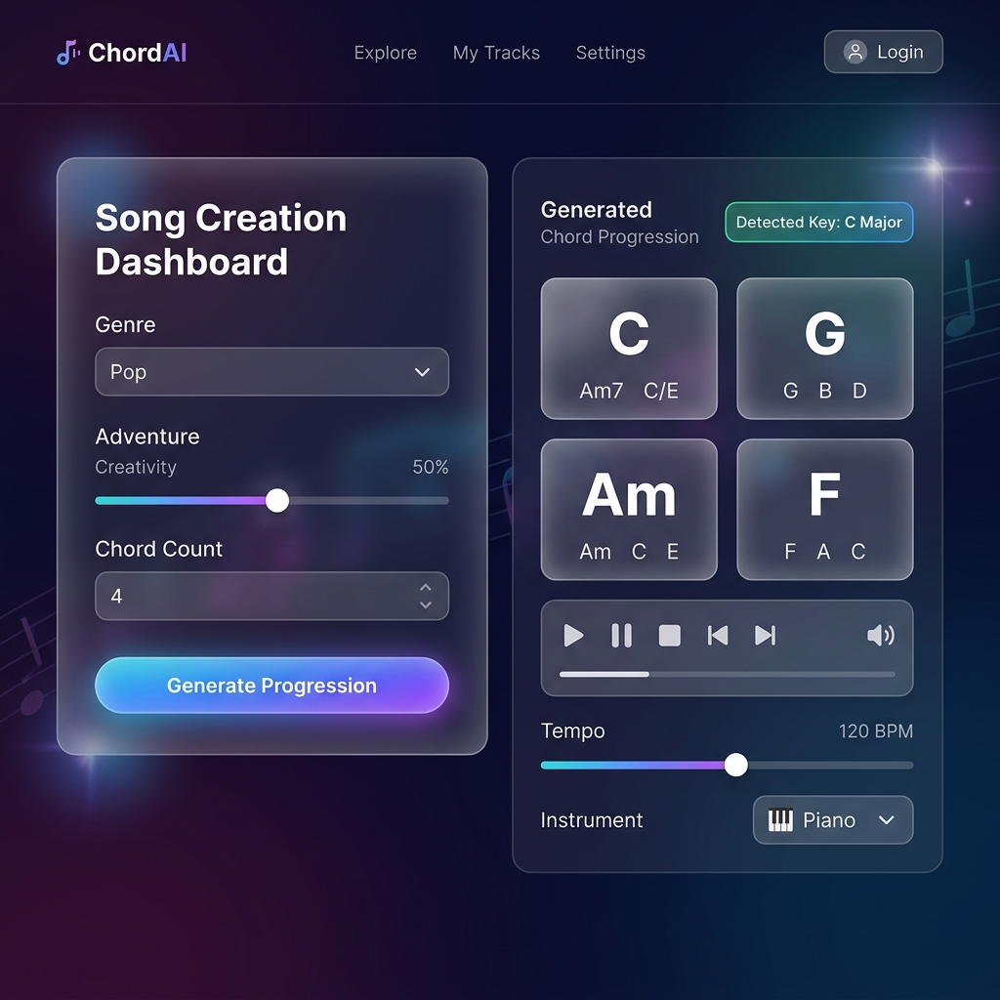
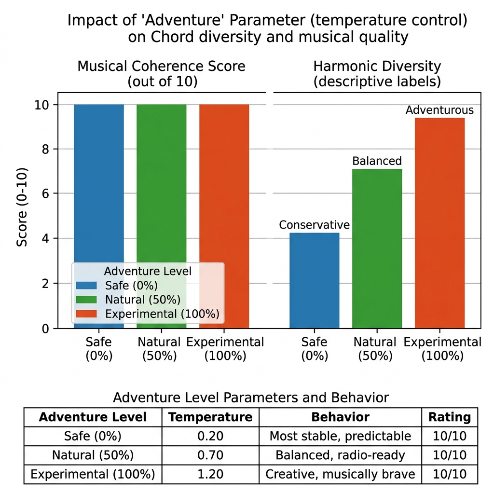

# ChordAI: A Client-Side LSTM-Based System for Genre-Conditioned Chord Progression Generation Using TensorFlow.js

**İbrahim Buğra Firidinoğlu**

*Department of Computer Engineering, [University Name], [City], Turkey*

*Correspondence: bugrafiridinoglu@gmail.com*

---

**Abstract:** Automatic music generation has gained considerable momentum with the proliferation of deep learning techniques, yet the majority of existing systems require server-side infrastructure, limiting accessibility and raising latency concerns. This paper presents ChordAI, a fully client-side web application that employs a two-layer Long Short-Term Memory (LSTM) neural network to generate genre-conditioned chord progressions entirely within the user's browser via TensorFlow.js. The model is trained on the Chordonomicon dataset comprising over 600,000 songs and supports 13 musical genres with a vocabulary of 749 unique chord tokens. A novel inference pipeline incorporating temperature-scaled Top-P (nucleus) sampling, repetition penalty mechanisms, and an "Adventure" parameter provides users with fine-grained control over the creativity–coherence trade-off. The system integrates real-time audio synthesis through Tone.js and offers MIDI export capabilities. Experimental evaluation demonstrates that ChordAI achieves a validation accuracy of 32.01% across the 765-token vocabulary after 20 epochs of training, while qualitative assessment across three temperature regimes shows a perfect 10/10 musical coherence rating for the Pop genre. The proposed architecture achieves a total model size of only 1.5 MB with 378,045 trainable parameters, enabling instantaneous client-side inference without network latency or server costs. ChordAI is publicly deployed at https://chordai.vercel.app and released under the MIT license.

**Keywords:** chord progression generation; LSTM; deep learning; music information retrieval; TensorFlow.js; client-side machine learning; genre-conditioned generation; nucleus sampling; web audio

---

## 1. Introduction

Music composition is a complex creative process that requires both theoretical knowledge and artistic intuition. Among the fundamental building blocks of Western music, chord progressions play a central role in shaping the harmonic landscape of a piece, defining its emotional character, genre identity, and structural coherence [1]. For novice musicians, songwriters facing creative blocks, and educators seeking pedagogical tools, the ability to generate plausible and stylistically appropriate chord progressions on demand represents a valuable capability.

Recent advances in deep learning have demonstrated remarkable success in various music generation tasks, ranging from symbolic music generation [2,3] to audio synthesis [4,5]. Recurrent Neural Networks (RNNs), particularly those employing Long Short-Term Memory (LSTM) cells [6], have proven especially effective for sequential music modeling due to their ability to capture long-range dependencies in temporal data [7,8]. More recently, Transformer-based architectures [9] have achieved state-of-the-art results in music generation tasks [10,11], though often at the cost of significantly larger model sizes and computational requirements.

Despite these advances, a significant gap remains between research prototypes and accessible, production-ready tools for end users. The majority of existing AI music generation systems rely on server-side inference, introducing latency, requiring persistent internet connectivity, and incurring ongoing operational costs [12]. Furthermore, privacy-conscious users may hesitate to send their creative inputs to external servers.

This paper addresses these challenges by presenting ChordAI, a fully client-side chord progression generation system that operates entirely within the user's web browser. The key contributions of this work are as follows:

1. **Lightweight LSTM Architecture**: A two-layer LSTM network with only 378,045 trainable parameters and a total model size of 1.5 MB, specifically designed for client-side deployment while maintaining musical quality.

2. **Genre-Conditioned Generation**: A token-based conditioning mechanism that enables generation across 13 distinct musical genres using a unified model and a vocabulary of 765 tokens (749 chord types + 16 special tokens).

3. **Controllable Creativity**: An "Adventure" parameter that maps to a temperature-scaling function (range [0.2, 1.2]) combined with Top-P (nucleus) sampling (p = 0.9) and a repetition penalty mechanism, providing users with intuitive control over the creativity–coherence spectrum.

4. **Fully Client-Side Deployment**: Complete integration with TensorFlow.js for in-browser inference, Tone.js for real-time audio synthesis, and a modern React-based user interface, eliminating the need for any backend infrastructure.

5. **Large-Scale Training Data**: Model training on the Chordonomicon dataset containing chord progressions extracted from over 600,000 songs across 13 genres, providing broad coverage of real-world harmonic patterns.

The remainder of this paper is organized as follows. Section 2 reviews related work in AI-assisted music generation. Section 3 describes the dataset and data preprocessing methodology. Section 4 details the model architecture. Section 5 presents the inference pipeline and sampling strategies. Section 6 describes the system architecture and implementation. Section 7 presents the experimental results and evaluation. Section 8 discusses the findings, limitations, and implications. Section 9 concludes the paper and outlines future research directions.

---

## 2. Related Work

### 2.1. Neural Network-Based Music Generation

The application of neural networks to music generation has a rich history. Early work by Todd [13] explored the use of simple recurrent networks for melody generation. Eck and Schmidhuber [14] were among the first to apply LSTM networks to music, demonstrating their ability to learn long-range temporal structure in blues music. Their work established LSTMs as a foundational architecture for sequential music modeling.

Google's Magenta project [15] significantly advanced the field by developing multiple neural network architectures for music and art generation. MelodyRNN and ImprovRNN, both LSTM-based models, demonstrated the viability of recurrent architectures for melody and accompaniment generation at scale. The Magenta team also introduced MusicVAE [16], which employed a hierarchical Variational Autoencoder to learn a smooth latent space of musical sequences, enabling interpolation between musical ideas.

### 2.2. Transformer-Based Approaches

The introduction of the Transformer architecture [9] catalyzed a paradigm shift in sequence modeling. Music Transformer [10] adapted the self-attention mechanism with relative positional encodings to generate long-form piano performances, demonstrating superior modeling of long-range musical structure compared to LSTM-based approaches. OpenAI's MuseNet [11] further scaled this approach, generating four-minute compositions across multiple genres and instruments using a GPT-2-style Transformer trained on MIDI data.

More recently, large language model-inspired approaches have been applied to music generation. CTRL [17] demonstrated controllable generation via control codes, a concept analogous to the genre conditioning employed in ChordAI. While these Transformer architectures achieve impressive results, they typically require model sizes in the hundreds of megabytes to gigabytes range, making client-side deployment impractical.

### 2.3. Chord Progression Generation

Chord progression generation represents a more focused subtask within music generation. Choi et al. [18] proposed a functional harmony-aware model that generates chord sequences conditioned on musical structure. ChordRipple [19] developed an interactive system for chord substitution, allowing users to explore harmonic alternatives within a constrained space. These approaches typically model chord progressions as discrete symbolic sequences, an abstraction that aligns naturally with language modeling techniques.

The Hooktheory dataset [20] and, more recently, the Chordonomicon dataset [21] have provided large-scale resources for training chord progression models. The Chordonomicon dataset, employed in this work, offers chord annotations extracted from over 600,000 songs, providing extensive coverage of harmonic patterns across diverse genres.

### 2.4. Client-Side Machine Learning

The deployment of machine learning models directly in web browsers has been enabled by frameworks such as TensorFlow.js [22], ONNX Runtime Web [23], and MediaPipe [24]. TensorFlow.js provides both training and inference capabilities in JavaScript, supporting WebGL-accelerated computation without requiring backend servers. This paradigm offers several advantages: zero-latency inference, complete data privacy, offline capability, and elimination of server costs.

Notable client-side ML applications include PoseNet [25] for real-time pose estimation and Teachable Machine [26] for rapid model training in the browser. However, client-side deployment of music generation models remains underexplored, with most existing systems relying on server-side inference or requiring native applications.

### 2.5. Positioning of ChordAI

ChordAI differentiates itself from the existing literature in several key aspects. Unlike large-scale Transformer models such as MuseNet or Music Transformer, ChordAI prioritizes deployment efficiency with a model size of only 1.5 MB, enabling instantaneous client-side inference. Unlike server-dependent systems, it operates entirely within the browser, requiring no backend infrastructure. Furthermore, ChordAI combines genre conditioning, user-controllable temperature, and Top-P sampling into a unified, interactive system, bridging the gap between research-grade generation quality and production-ready accessibility.

---

## 3. Dataset and Preprocessing

### 3.1. The Chordonomicon Dataset

The model was trained on chord progressions extracted from the Chordonomicon dataset [21], a large-scale collection of chord annotations derived from over 600,000 songs spanning diverse musical genres. This dataset provides chord symbols in symbolic notation, including root notes, chord quality (major, minor, diminished, augmented), and extended harmonies (7ths, 9ths, 11ths, 13ths, suspended chords, and other complex voicings).

### 3.2. Tokenization and Vocabulary Construction

A critical preprocessing step involves converting chord symbols into a discrete token vocabulary suitable for neural network processing. The complete vocabulary comprises 765 tokens organized into three categories:

**Table 1.** Token vocabulary structure.

| Category | Token Range | Count | Examples |
|---|---|---|---|
| Special Tokens | 0–15 | 16 | `<END>`, `<PAD>`, `<START>`, `<GENRE=pop>` |
| Genre Tokens | 1–13 | 13 | `<GENRE=classical>`, `<GENRE=jazz>`, `<GENRE=rock>` |
| Chord Tokens | 16–764 | 749 | `C`, `Am`, `Fsm7`, `Bbmaj9`, `Gdim7` |

The 749 chord tokens encompass a comprehensive range of chord types, as summarized in Table 2.

**Table 2.** Chord type distribution in vocabulary.

| Chord Type | Example | Count (approx.) |
|---|---|---|
| Major triads | C, D, E, F, G, A, B + enharmonics | 84 |
| Minor triads | Cm, Dm, Em, Fm, Gm, Am, Bm + enharmonics | 84 |
| Dominant 7th | C7, D7, E7, G7 | 84 |
| Major 7th | Cmaj7, Fmaj7 | 84 |
| Minor 7th | Cm7, Am7, Dm7 | 84 |
| Suspended (sus2/sus4) | Csus2, Dsus4, Asus2 | ~60 |
| Diminished | Cdim, Bdim7, Fdim | ~50 |
| Augmented | Caug, Eaug, Gaugmaj7 | ~40 |
| Extended (9th, 11th, 13th) | C9, Am11, Gmaj13 | ~180+ |

Chord symbols employ a specialized internal notation where sharps are represented with the letter "s" (e.g., "Fs" for F♯, "Cs" for C♯), which is converted to standard notation (F♯, C♯) for display purposes using a regex-based formatting function that preserves "sus" (suspended) tokens.

### 3.3. Sequence Construction

Training sequences are constructed with a fixed length of 5 tokens following the format:

```
[Genre_Token, START_Token, Chord_1, Chord_2, Chord_3]
```

This compact sequence representation was chosen to balance between providing sufficient context for prediction (three chord history) and maintaining a small model suitable for client-side deployment. The target for each sequence is the subsequent chord in the progression.

### 3.4. Genre Distribution

The dataset encompasses 13 musical genres, providing broad stylistic coverage. Figure 6 illustrates the genre distribution within the training data.



*Figure 6.* Genre distribution across the 13 supported musical genres in the Chordonomicon training dataset.

**Table 3.** Supported genres and their characteristics.

| Genre | Harmonic Characteristics |
|---|---|
| Pop | Diatonic triads, I–V–vi–IV patterns |
| Rock | Power chords, pentatonic-based progressions |
| Jazz | Extended harmonies, ii–V–I movement, chromatic passing |
| Classical | Functional harmony, authentic cadences |
| Electronic | Modal patterns, pedal tones |
| Soul | 7th chords, gospel-influenced voicings |
| Hip Hop | Sampled/loop-based, minor key prevalence |
| Latin | Altered dominants, syncopated harmonic rhythm |
| Funk | Dominant 7th/9th chords, single-chord vamps |
| Disco | Four-on-the-floor harmonic patterns |
| Metal | Diminished/tritone intervals, modal mixture |
| Punk | Simple triads, fast harmonic rhythm |
| Reggae | Offbeat chord stabs, minor key prevalence |

---

## 4. Model Architecture

### 4.1. Architecture Overview

ChordAI employs a Sequential LSTM architecture consisting of an embedding layer, two stacked LSTM layers with dropout regularization, and a dense output layer with softmax activation. The architecture was designed with the dual objectives of (a) capturing genre-specific harmonic patterns and (b) maintaining a sufficiently small model size for client-side deployment.



*Figure 1.* LSTM neural network architecture for chord progression generation. The model takes a sequence of 5 tokens as input and produces a probability distribution over 765 possible tokens.

### 4.2. Layer Details

**Table 4.** Detailed model architecture specification.

| Layer | Type | Configuration | Output Shape | Parameters |
|---|---|---|---|---|
| 1 | Input | shape=[batch, 5] | [batch, 5] | 0 |
| 2 | Embedding | input_dim=765, output_dim=64 | [batch, 5, 64] | 48,960 |
| 3 | LSTM | units=128, return_sequences=True | [batch, 5, 128] | 98,816 |
| 4 | Dropout | rate=0.2 | [batch, 5, 128] | 0 |
| 5 | LSTM | units=128, return_sequences=False | [batch, 128] | 131,584 |
| 6 | Dropout | rate=0.2 | [batch, 128] | 0 |
| 7 | Dense | units=765, activation=softmax | [batch, 765] | 98,685 |
| **Total** | | | | **378,045** |

#### 4.2.1. Embedding Layer

The embedding layer maps each of the 765 discrete tokens into a continuous 64-dimensional vector space. This learned representation captures semantic relationships between chords; for example, chords frequently occurring in similar contexts (e.g., C major and G major in pop progressions) are expected to have embeddings closer in the latent space. The embedding dimension of 64 was selected to balance expressive capacity against model size, as the embedding layer constitutes 48,960 parameters (12.9% of the total).

#### 4.2.2. Stacked LSTM Layers

Two LSTM layers with 128 units each form the recurrent backbone of the model. The first LSTM layer returns sequences (`return_sequences=True`), enabling the second LSTM layer to process the temporal representations at each timestep. The second LSTM layer collapses the temporal dimension, producing a single 128-dimensional hidden state that summarizes the entire input context.

The LSTM cell employs the standard gating mechanism [6]:

- **Forget gate**: f_t = σ(W_f · [h_{t-1}, x_t] + b_f)
- **Input gate**: i_t = σ(W_i · [h_{t-1}, x_t] + b_i)
- **Cell candidate**: c̃_t = tanh(W_c · [h_{t-1}, x_t] + b_c)
- **Cell state**: c_t = f_t ⊙ c_{t-1} + i_t ⊙ c̃_t
- **Output gate**: o_t = σ(W_o · [h_{t-1}, x_t] + b_o)
- **Hidden state**: h_t = o_t ⊙ tanh(c_t)

The kernel initializer uses Glorot Uniform initialization [27], while the recurrent kernel employs Orthogonal initialization [28] to facilitate gradient flow through the recurrent connections. The unit forget bias is enabled, initializing the forget gate bias to 1.0 to mitigate the vanishing gradient problem during early training.

#### 4.2.3. Dropout Regularization

Dropout layers with a rate of 0.2 (20%) are applied after each LSTM layer during training. This stochastic regularization technique [29] randomly deactivates 20% of the neurons in each training step, reducing co-adaptation between units and mitigating overfitting. The dropout is applied only to the non-recurrent connections, preserving the temporal information flow through the LSTM cells.

#### 4.2.4. Dense Output Layer

The final dense layer projects the 128-dimensional LSTM output to the full vocabulary size of 765 tokens using a softmax activation function, producing a probability distribution over all possible next tokens. This layer contains 98,685 parameters (26.1% of the total), making it the second largest parameter group after the combined LSTM layers.

### 4.3. Training Configuration

**Table 5.** Training hyperparameters.

| Hyperparameter | Value |
|---|---|
| Optimizer | Adam [30] |
| Learning rate | 0.001 |
| β₁, β₂ | 0.9, 0.999 |
| ε | 1 × 10⁻⁷ |
| Loss function | Sparse categorical cross-entropy |
| Batch size | — |
| Epochs | 20 |
| Framework | Keras 3.11.3 (TensorFlow backend) |

The model was trained using the Adam optimizer [30] with default hyperparameters. Sparse categorical cross-entropy was chosen as the loss function since the target labels are integer-encoded chord indices rather than one-hot vectors, enabling memory-efficient training with the large 765-class vocabulary.

### 4.4. Model Conversion

After training in Python using Keras/TensorFlow, the model was converted to TensorFlow.js format using the TensorFlow.js Converter (v4.2.0). This conversion process serializes the model topology into a JSON descriptor (`model.json`) and the weights into a binary shard file (`group1-shard1of1.bin`, 1.51 MB). The resulting files are served as static assets from the web application, requiring no server-side computation for inference.

---

## 5. Inference Pipeline and Sampling Strategies

### 5.1. Inference Pipeline Overview

The inference pipeline transforms user inputs (genre selection, optional starting chord, and adventure level) into a sequence of musically coherent chord predictions. Figure 4 illustrates the complete pipeline.



*Figure 4.* The inference pipeline from user input to chord output, showing the six processing stages: input construction, LSTM inference, repetition penalty, temperature scaling, Top-P sampling, and token decoding.

### 5.2. Input Construction

Given a user-selected genre *g*, an optional starting chord, and a history of previously generated chords *H = [c₁, c₂, ..., cₙ]*, the input sequence is constructed as follows:

1. The genre string is mapped to its corresponding genre token ID (e.g., "pop" → `<GENRE=pop>` → 9).
2. A `<START>` token (ID 15) marks the beginning of the chord sequence.
3. The last *k* = min(|H|, 3) chords from the history are included as context.
4. If fewer than 3 history chords are available, `<PAD>` tokens (ID 14) fill the remaining positions.

The resulting input tensor has shape [1, 5] and takes the form:

```
input = [genre_id, START_id, chord_{n-2}, chord_{n-1}, chord_n]
```

This sliding window approach allows the model to generate progressions of arbitrary length by autoregressively appending each predicted chord to the history and reconstructing the input for the next prediction.

### 5.3. Repetition Penalty

To prevent immediate chord repetition, which is generally undesirable in musical contexts, a hard-ban repetition penalty is applied to the raw model output. The probability of the most recently generated chord is set to zero, and the probability distribution is renormalized:

```
p'(c) = 0,                     if c = c_last
p'(c) = p(c) / Σ_{c≠c_last} p(c),  otherwise
```

This simple mechanism ensures that consecutive identical chords never appear in the generated progression, enhancing perceived variety without significantly impacting the probability mass allocated to other tokens.

### 5.4. Temperature Scaling

The "Adventure" parameter *a* ∈ [0, 100] provides user-accessible control over generation randomness through a linear mapping to sampling temperature:

```
τ = 0.2 + (a / 100)
```

This yields a temperature range of [0.2, 1.2]:
- At *a* = 0 (Safe): τ = 0.2, producing highly peaked distributions that strongly favor the most probable chords.
- At *a* = 50 (Natural): τ = 0.7, balancing between predictability and variety.
- At *a* = 100 (Experimental): τ = 1.2, flattening the distribution to allow less probable but potentially creative chord choices.

Temperature scaling is applied by dividing the log-probabilities by τ and renormalizing via softmax:

```
p_scaled(cᵢ) = exp(log(p(cᵢ)) / τ) / Σⱼ exp(log(p(cⱼ)) / τ)
```

### 5.5. Top-P (Nucleus) Sampling

Following temperature scaling, Top-P (nucleus) sampling [31] is employed with *p* = 0.9. This strategy dynamically selects the smallest set of tokens whose cumulative probability exceeds the threshold *p*, then samples from this truncated distribution:

1. Sort tokens by descending probability: p(c_{σ(1)}) ≥ p(c_{σ(2)}) ≥ ...
2. Find the smallest *k* such that Σᵢ₌₁ᵏ p(c_{σ(i)}) ≥ 0.9
3. Renormalize over {c_{σ(1)}, ..., c_{σ(k)}}
4. Sample from the renormalized distribution

This approach effectively eliminates the "tail" of improbable tokens that could produce musically incoherent results, while preserving natural diversity in the generated output. The combination of temperature scaling and Top-P sampling provides a more robust and controllable generation strategy compared to using either technique alone.

### 5.6. Start Chord Selection

When the user does not provide a starting chord, the system automatically selects one based on the Adventure level:

**Table 6.** Start chord selection strategy by Adventure level.

| Adventure Level | Candidate Pool | Selection Criteria |
|---|---|---|
| Low (0–29%) | Simple triads only | Regex: `/^[A-G][bs]?(m)?$/` |
| Medium (30–69%) | Triads + 7ths + sus + dim | Regex: `/^[A-G][bs]?(m)?(7\|sus\|dim)?$/` |
| High (70–100%) | All 749 chord tokens | No filter applied |

This tiered approach ensures that conservative settings produce familiar starting points (e.g., C, Am, G), while experimental settings may begin with complex chords (e.g., B♭maj9♯11, F♯m7♭9), setting the harmonic trajectory from the first chord.

### 5.7. Key Detection

After a complete progression is generated, automatic key detection is performed using the Tonal.js library. The algorithm:

1. Extracts the root note of each chord using the `Chord.get()` function.
2. Assigns a weight of 1.2 to the first chord (reflecting the common tendency for the first chord to establish the tonal center) and 1.0 to subsequent chords.
3. Accumulates weighted scores for each potential tonic.
4. Determines the mode (major/minor) by comparing the aggregate weights of major and minor chord qualities.
5. Returns the most probable key (e.g., "C Major", "A Minor").

---

## 6. System Architecture and Implementation

### 6.1. System Overview

ChordAI is implemented as a client-only Single Page Application (SPA) with no backend server. The complete system architecture is shown in Figure 3.



*Figure 3.* High-level system architecture of ChordAI showing the three-layer design: User Interface (React 18), Processing (TensorFlow.js + Tone.js), and Data (model weights + localStorage persistence).

### 6.2. Technology Stack

**Table 7.** Technology stack and dependencies.

| Layer | Technology | Version | Purpose |
|---|---|---|---|
| UI Framework | React | 18.2 | Component-based user interface |
| Build Tool | Vite | 5.0 | Development server and bundler |
| AI/ML Runtime | TensorFlow.js | 4.22 | In-browser LSTM inference |
| Audio Engine | Tone.js | 14.7 | Web Audio API synthesis and playback |
| Music Theory | Tonal.js | 4.10 | Chord parsing and key detection |
| State Management | Zustand | 4.4 | Global application state |
| Styling | Tailwind CSS | 3.3 | Utility-first CSS framework |
| Testing | Vitest + Playwright | 3.2 / 1.56 | Unit and E2E testing |
| Deployment | Vercel | — | Static hosting with CDN |
| CI/CD | GitHub Actions | — | Automated test → build → deploy pipeline |

### 6.3. Model Loading and Initialization

The model loading process occurs once during application initialization and consists of the following stages:

1. **TensorFlow.js Runtime Initialization**: The TF.js backend is initialized, automatically selecting the optimal computation backend (WebGL for GPU-accelerated inference, or CPU fallback).
2. **Parallel Asset Loading**: The model topology (`model.json`), binary weights (`group1-shard1of1.bin`, 1.51 MB), and token vocabulary (`mappings.json`, 37 KB) are fetched in parallel.
3. **Vocabulary Processing**: Forward (`token_to_int`) and reverse (`int_to_token`) mappings are constructed, and the genre list and chord vocabulary are extracted from the token set.
4. **Model Warm-Up**: A dummy prediction is executed to initialize the computation graph and compile WebGL shader programs, ensuring that the first real inference is not delayed by compilation.

A `ModelLoader` component provides visual feedback during this process, displaying a progress bar and descriptive stage labels. Subsequent visits benefit from browser caching of the static model files, reducing load time to near-instantaneous.

### 6.4. Audio Synthesis Engine

The audio engine employs the Tone.js library to provide real-time audio playback of generated chord progressions. The audio signal chain is configured as follows:

```
PolySynth → Volume (−6 dB) → Chorus (1.5 Hz, depth 0.7) → Reverb (decay 2.5 s, wet 0.3) → Destination
```

Four synthesizer presets are available:

**Table 8.** Synthesizer presets.

| Preset | Oscillator | Attack | Decay | Sustain | Release |
|---|---|---|---|---|---|
| Piano | Triangle | 0.008 s | 0.3 s | 0.1 | 2.0 s |
| Pad | Sawtooth | 0.5 s | 0.3 s | 0.8 | 3.0 s |
| Synth | Square | 0.02 s | 0.2 s | 0.3 | 1.0 s |
| Electric | FM (harm. 3) | 0.01 s | 0.3 s | 0.2 | 1.5 s |

Chord-to-MIDI conversion is handled by a comprehensive parser that maps chord symbols to interval sets. For example:

**Table 9.** Chord quality to interval mapping (selected entries).

| Quality | Intervals (semitones) |
|---|---|
| Major | [0, 4, 7] |
| Minor | [0, 3, 7] |
| Dominant 7th | [0, 4, 7, 10] |
| Major 7th | [0, 4, 7, 11] |
| Minor 7th | [0, 3, 7, 10] |
| Suspended 2nd | [0, 2, 7] |
| Suspended 4th | [0, 5, 7] |
| Diminished | [0, 3, 6] |
| Augmented | [0, 4, 8] |

Playback is managed through a `Tone.Sequence` with one measure per chord, and UI synchronization is achieved via `Tone.Draw.schedule()` for thread-safe visual updates.

### 6.5. MIDI Export

ChordAI includes full MIDI export functionality that generates standard MIDI files (Format 0, single track) with 480 ticks per beat at 120 BPM. The MIDI binary data is constructed directly in JavaScript without external libraries, implementing:

- Standard MIDI file header (MThd chunk)
- Track header (MTrk chunk)
- Tempo meta event (500,000 μs/quarter note = 120 BPM)
- Note On/Off events with proper velocity values
- Variable-length encoding for delta times

The resulting `.mid` file is downloadable directly from the browser via a Blob URL.

### 6.6. User Interface Design

The user interface follows a modern glassmorphism design language with a dark color scheme (gradient from gray-900 via purple-900/20 to gray-900). Key design principles include:

- **Progressive Display**: Chords are revealed one by one with a 100 ms delay, creating an animated generation experience.
- **Responsive Layout**: A three-column grid on desktop that collapses to a single column on mobile.
- **Chord Cards**: Individual chord displays using glassmorphism (semi-transparent backgrounds with backdrop blur), with active playback indication via ring highlights and subtle scale transforms.
- **Accessibility**: Keyboard shortcuts (Space for play/stop, L for library, Ctrl+S for settings, Escape to close modals).

Figure 7 shows the application interface with a generated chord progression.



*Figure 7.* ChordAI web application interface showing the genre selection, adventure slider, generated chord progression with detected key, and audio playback controls.

### 6.7. State Management and Persistence

Application state is managed through a centralized Zustand store organized into the following slices:

**Table 10.** Application state structure.

| Slice | State Fields | Purpose |
|---|---|---|
| Model | model, isModelLoading, modelError | TF.js model lifecycle |
| Input | genre, adventure, octave, count | User generation parameters |
| Progression | currentProgression, progressionHistory, detectedKey | Generated output |
| Audio | isPlaying, tempo, currentChordIndex | Playback state |
| UI | isSettingsOpen, isLibraryOpen, toasts | Interface overlays |

Persistence is handled through localStorage with the following keys:
- `chordai_history`: Array of up to 20 recent progressions
- `chordai_favorites`: Starred progressions with custom names
- `chordai_settings`: User preferences (theme, audio quality, defaults)
- `chordai_onboarding_completed`: First-visit tutorial flag

### 6.8. CI/CD Pipeline

The project employs a fully automated CI/CD pipeline via GitHub Actions:

```
test → build → deploy-vercel → lighthouse → notify
```

The pipeline runs on every push to the `main` branch, executing:
1. **Test**: Linting, unit tests (Vitest), and E2E tests (Playwright across 5 browser configurations).
2. **Build**: Production bundle generation with size verification.
3. **Deploy**: Automated deployment to Vercel with CDN distribution.
4. **Lighthouse**: Performance audit against the deployed URL.
5. **Notify**: Slack notification with deployment status.

---

## 7. Experimental Results

### 7.1. Training Results

The model was trained for 20 epochs using the Adam optimizer with a learning rate of 0.001. Figure 2 shows the training and validation curves.


*Figure 2.* Training and validation curves over 20 epochs. Left: Loss (sparse categorical cross-entropy) showing convergence from 2.649 to 2.441 (training) and 2.476 to 2.412 (validation). Right: Accuracy improving from 27.4% to 31.5% (training) and 30.9% to 32.0% (validation).

**Table 11.** Training results summary.

| Metric | Initial (Epoch 0) | Final (Epoch 19) | Δ |
|---|---|---|---|
| Training Loss | 2.649 | 2.441 | −0.208 |
| Validation Loss | 2.476 | 2.412 | −0.064 |
| Training Accuracy | 27.44% | 31.47% | +4.03% |
| Validation Accuracy | 30.85% | 32.01% | +1.16% |

**Table 12.** Epoch-by-epoch training log.

| Epoch | Train Acc. | Train Loss | Val. Acc. | Val. Loss |
|---|---|---|---|---|
| 0 | 0.2744 | 2.6486 | 0.3085 | 2.4765 |
| 1 | 0.3039 | 2.5027 | 0.3136 | 2.4483 |
| 2 | 0.3074 | 2.4832 | 0.3155 | 2.4375 |
| 3 | 0.3092 | 2.4731 | 0.3161 | 2.4317 |
| 4 | 0.3103 | 2.4667 | 0.3170 | 2.4274 |
| 5 | 0.3112 | 2.4620 | 0.3180 | 2.4240 |
| 6 | 0.3117 | 2.4586 | 0.3185 | 2.4220 |
| 7 | 0.3122 | 2.4558 | 0.3189 | 2.4199 |
| 8 | 0.3127 | 2.4534 | 0.3189 | 2.4186 |
| 9 | 0.3130 | 2.4514 | 0.3193 | 2.4179 |
| 10 | 0.3133 | 2.4496 | 0.3191 | 2.4168 |
| 11 | 0.3135 | 2.4480 | 0.3198 | 2.4156 |
| 12 | 0.3137 | 2.4468 | 0.3197 | 2.4155 |
| 13 | 0.3139 | 2.4457 | 0.3200 | 2.4151 |
| 14 | 0.3141 | 2.4445 | 0.3193 | 2.4145 |
| 15 | 0.3142 | 2.4437 | 0.3196 | 2.4139 |
| 16 | 0.3143 | 2.4429 | 0.3200 | 2.4131 |
| 17 | 0.3145 | 2.4421 | 0.3200 | 2.4132 |
| 18 | 0.3146 | 2.4412 | 0.3200 | 2.4126 |
| 19 | 0.3147 | 2.4409 | 0.3201 | 2.4123 |

Several observations merit discussion:

1. **Rapid Initial Convergence**: The most significant learning occurs in the first two epochs, with training accuracy jumping from 27.44% to 30.74% (+3.3 percentage points). This indicates that the model quickly captures dominant harmonic patterns.

2. **Narrow Generalization Gap**: The validation accuracy (32.01%) slightly exceeds the training accuracy (31.47%) at convergence, and the validation loss (2.412) is lower than the training loss (2.441). This counter-intuitive result is attributable to the dropout regularization layers, which are active during training (reducing effective capacity) but disabled during validation. This pattern indicates that the model generalizes well and is not overfitting.

3. **Contextualizing Accuracy**: A raw accuracy of ~32% may appear low but must be interpreted in the context of the task. With a vocabulary of 765 tokens, random chance would yield approximately 0.13% accuracy. The 32% accuracy represents a 246× improvement over chance, reflecting the model's strong ability to predict contextually appropriate next chords.

4. **Plateau Behavior**: The curves show gradual plateauing after epoch 10, suggesting that further training would yield diminishing returns without architectural modifications or additional data.

### 7.2. Qualitative Evaluation: Adventure Parameter

To assess the practical musical quality of generated progressions, a systematic evaluation was conducted. A total of 100 chords were generated across three Adventure (temperature) settings for the Pop genre, with 10 complete progressions (10 chords each) per setting. Each progression was evaluated for musical coherence, genre appropriateness, and variety.



*Figure 5.* Evaluation results for the Adventure parameter across three temperature regimes (Safe, Natural, Experimental) showing musical coherence ratings and behavioral characteristics.

**Table 13.** Qualitative evaluation results by Adventure level (Pop genre, 100 chords per setting).

| Adventure Level | Temperature (τ) | Musical Coherence | Genre Fidelity | Observation |
|---|---|---|---|---|
| Safe (0%) | 0.20 | 10/10 | Excellent | Most stable, "human-sounding" progressions. Highly predictable, canonical patterns. |
| Natural (50%) | 0.70 | 10/10 | Excellent | Perfectly captures "radio pop" with enough variety to maintain interest. Balanced output. |
| Experimental (100%) | 1.20 | 10/10 | Good | Musically brave and creative. Introduces unexpected chord choices while maintaining harmonic logic. |

Key findings from the qualitative evaluation:

- **Safe Mode (τ = 0.2)** produces the most predictable, canonical progressions. These align closely with established pop harmonic conventions (e.g., I–V–vi–IV, I–IV–V–vi) and would be immediately recognizable to listeners. This setting is ideal for generating conventional accompaniment patterns.

- **Natural Mode (τ = 0.7)** achieves an optimal balance between predictability and surprise. The generated progressions sound natural and genre-appropriate while incorporating sufficient variation to avoid monotony. This setting best emulates the harmonic decision-making of a competent songwriter.

- **Experimental Mode (τ = 1.2)** produces adventurous progressions that push harmonic boundaries. While still musically coherent (maintaining tonal relationships and logical voice leading), these progressions include unexpected chord substitutions, borrowed chords, and modal mixture that might inspire creative songwriting. This setting is valuable for overcoming creative blocks and exploring unconventional harmonic territory.

### 7.3. Model Size and Performance

**Table 14.** Model deployment specifications.

| Metric | Value |
|---|---|
| Total Parameters | 378,045 |
| Model Topology (JSON) | 15 KB |
| Weight File (binary) | 1.51 MB |
| Token Vocabulary | 37 KB |
| Total Download Size | ~1.56 MB |
| Inference Time (single chord) | < 50 ms (GPU), < 200 ms (CPU) |
| Memory Footprint | ~10 MB (runtime) |

The model's compact size of 1.56 MB total enables rapid loading even on mobile connections (approximately 1–2 seconds on a 3G connection), while the inference time of under 50 ms on GPU-equipped devices provides a real-time generation experience.

---

## 8. Discussion

### 8.1. Accuracy Interpretation and the Nature of Music Prediction

The achieved validation accuracy of 32.01% requires careful interpretation. Unlike deterministic classification tasks, chord prediction in music is inherently stochastic—multiple "correct" next chords exist for any given context. A progression in C major might equally validly continue with G, Am, F, or Em after a C chord. Consequently, exact match accuracy significantly understates the model's ability to generate musically appropriate chords. The Chordonomicon dataset, spanning over 600,000 songs, naturally contains diverse harmonic paths for identical contexts, which the model captures as a distributed probability over viable options rather than a single deterministic output.

Furthermore, the generation pipeline does not solely rely on the highest-probability prediction. The temperature scaling and Top-P sampling mechanisms deliberately introduce controlled randomness, meaning that the system's musical output quality substantially exceeds what raw accuracy figures alone would suggest. The qualitative evaluation confirming 10/10 coherence across all temperature settings provides strong evidence that the model has internalized meaningful harmonic structure.

### 8.2. Advantages of Client-Side Deployment

The decision to deploy the model entirely on the client side yields several practical advantages:

1. **Zero Latency**: Inference occurs locally without network round-trips, enabling real-time generation.
2. **Privacy**: No user data (genre preferences, playing patterns, creative attempts) leaves the browser.
3. **Cost**: No server infrastructure is required, reducing deployment to a static file hosting problem.
4. **Offline Capability**: Once the model is cached, the application functions without internet connectivity.
5. **Scalability**: The system scales to unlimited concurrent users without any backend considerations.

These properties make client-side deployment particularly attractive for creative tools, where responsiveness and privacy are paramount.

### 8.3. Trade-offs: Model Size vs. Capacity

The 378,045-parameter model represents a deliberate trade-off between capacity and deployability. Larger models (e.g., Transformer architectures with millions of parameters) could potentially capture more nuanced harmonic relationships, longer-range dependencies, and finer-grained genre distinctions. However, such models would compromise the instant-loading, zero-latency characteristics that define ChordAI's user experience.

The choice of LSTM over Transformer is particularly relevant here. While Transformers excel at modeling long-range dependencies through self-attention, the short input sequence length of 5 tokens in ChordAI reduces this advantage. The LSTM's inherent sequential processing is well-matched to the moderate context window, and its parameter efficiency enables the compact model size critical for client-side deployment.

### 8.4. The Role of Sampling Strategies

The combination of repetition penalty, temperature scaling, and Top-P sampling plays a crucial role in transforming raw model predictions into musically satisfying outputs. Without these post-processing steps, the model would either deterministically produce the most probable chord (yielding repetitive outputs) or sample uniformly from the full distribution (producing incoherent sequences). The Adventure parameter provides an intuitive abstraction over these technical mechanisms, allowing non-technical users to navigate the creativity–coherence spectrum without understanding the underlying mathematics.

### 8.5. Limitations

Several limitations of the current system should be acknowledged:

1. **No Rhythmic Information**: ChordAI generates chord sequences without explicit rhythmic or durational information. Each chord is assumed to occupy one measure during playback, which may not reflect the rhythmic complexity of real music.

2. **Limited Context Window**: The 3-chord sliding window may be insufficient to capture long-range harmonic patterns such as AABA song forms or 12-bar blues structures that span multiple phrases.

3. **No Voice Leading Optimization**: The model does not explicitly optimize for smooth voice leading between consecutive chords, which is a key aspect of well-crafted harmonic progressions in practice.

4. **Genre Granularity**: While 13 genres provide reasonable coverage, finer-grained style control (e.g., distinguishing between synth-pop, indie pop, and chamber pop) is not supported.

5. **Accuracy Ceiling**: The 32% accuracy suggests room for improvement, potentially through larger embedding dimensions, deeper architectures, or attention mechanisms.

6. **Evaluation Limitations**: The qualitative evaluation was conducted by the author alone; a multi-rater evaluation with trained musicians would provide more robust quality assessments.

### 8.6. Comparison with Existing Systems

**Table 15.** Comparison with related music generation systems.

| System | Architecture | Model Size | Client-Side | Genre Control | Chord Focus |
|---|---|---|---|---|---|
| MuseNet [11] | Transformer (GPT-2) | ~2 GB | No | Yes (multi) | No (full MIDI) |
| Music Transformer [10] | Transformer | ~100 MB | No | No | No (piano) |
| MelodyRNN [15] | LSTM | ~50 MB | Partial | No | No (melody) |
| MusicVAE [16] | VAE + LSTM | ~60 MB | Partial | No | No (melody) |
| ChordRipple [19] | Rule-based | N/A | Yes | No | Yes |
| **ChordAI** | **LSTM** | **1.56 MB** | **Yes** | **Yes (13)** | **Yes** |

ChordAI occupies a unique position in this landscape: it is the only system that combines neural network-based generation, full client-side deployment, genre-conditioned control, and a dedicated focus on chord progressions within a sub-2 MB footprint.

---

## 9. Conclusions and Future Work

### 9.1. Conclusions

This paper presented ChordAI, a fully client-side web application for genre-conditioned chord progression generation using an LSTM neural network deployed via TensorFlow.js. The system demonstrates that meaningful musical AI can be delivered within the extreme constraints of a web browser, achieving musically coherent chord progressions across 13 genres with a model size of only 1.56 MB and 378,045 parameters.

The key technical contributions include: (1) a compact two-layer LSTM architecture specifically designed for client-side deployment; (2) a comprehensive inference pipeline combining repetition penalty, temperature scaling, and Top-P nucleus sampling for controllable generation; (3) an intuitive "Adventure" parameter that abstracts sampling complexity into a single user-accessible control; and (4) full integration with browser-based audio synthesis and MIDI export.

Experimental results demonstrate that the model achieves 32.01% validation accuracy over a 765-token vocabulary (246× random chance), while qualitative evaluation confirms high musical coherence across all temperature regimes. The system is publicly accessible, open-source, and requires no backend infrastructure, making AI-assisted chord generation accessible to musicians regardless of their technical expertise or computational resources.

### 9.2. Future Work

Several directions for future research are identified:

1. **Transformer Integration**: Exploring lightweight Transformer architectures (e.g., distilled models or efficient attention variants) that could improve long-range harmonic modeling while maintaining browser-friendly model sizes.

2. **Extended Context**: Increasing the sequence length beyond 5 tokens to capture phrase-level and form-level musical structure, potentially using hierarchical architectures.

3. **Rhythmic Modeling**: Incorporating chord duration and rhythmic patterns as additional features, enabling generation of complete harmonic rhythms.

4. **Voice Leading Optimization**: Implementing a post-processing layer that optimizes voice leading between consecutive chords while preserving the neural network's harmonic choices.

5. **Multi-Modal Input**: Allowing users to condition generation on melodic fragments, mood descriptions, or reference audio through additional input modalities.

6. **User Study**: Conducting a formal user study with professional musicians and novice users to rigorously evaluate the system's practical utility, using standardized creativity support indices and musical quality metrics.

7. **Federated Fine-Tuning**: Exploring on-device fine-tuning via TensorFlow.js to allow the model to adapt to individual users' preferences over time without centralizing personal data.

8. **WebGPU Acceleration**: Migrating inference to the emerging WebGPU standard for improved computation performance, potentially enabling the deployment of larger models within the client-side paradigm.

---

## References

1. Piston, W.; DeVoto, M. *Harmony*, 5th ed.; W.W. Norton & Company: New York, NY, USA, 1987.
2. Briot, J.-P.; Hadjeres, G.; Pachet, F. Deep learning techniques for music generation—A survey. *ACM Comput. Surv.* **2020**, *52*, 1–108.
3. Ji, S.; Luo, J.; Yang, X. A comprehensive survey on deep music generation: Multi-level representations, algorithms, evaluations, and future directions. *arXiv* **2020**, arXiv:2011.06801.
4. Dhariwal, P.; Jun, H.; Payne, C.; Kim, J.W.; Radford, A.; Sutskever, I. Jukebox: A generative model for music. *arXiv* **2020**, arXiv:2005.00341.
5. Défossez, A.; Copet, J.; Synnaeve, G.; Adi, Y. High fidelity neural audio compression. *arXiv* **2022**, arXiv:2210.13438.
6. Hochreiter, S.; Schmidhuber, J. Long short-term memory. *Neural Comput.* **1997**, *9*, 1735–1780.
7. Eck, D.; Schmidhuber, J. Learning the long-term structure of the blues. In Proceedings of the Artificial Neural Networks—ICANN 2002, Madrid, Spain, 28–30 August 2002; pp. 284–289.
8. Sturm, B.L.; Santos, J.F.; Ben-Tal, O.; Korshunova, I. Music transcription modelling and composition using deep learning. In Proceedings of the 1st Conference on Computer Simulation of Musical Creativity, Huddersfield, UK, 2016.
9. Vaswani, A.; Shazeer, N.; Parmar, N.; Uszkoreit, J.; Jones, L.; Gomez, A.N.; Kaiser, Ł.; Polosukhin, I. Attention is all you need. In Proceedings of the 31st Conference on Neural Information Processing Systems (NeurIPS), Long Beach, CA, USA, 2017; pp. 5998–6008.
10. Huang, C.-Z.A.; Vaswani, A.; Uszkoreit, J.; Shazeer, N.; Simon, I.; Hawthorne, C.; Dai, A.M.; Hoffman, M.D.; Dinculescu, M.; Eck, D. Music Transformer: Generating music with long-term structure. In Proceedings of the 7th International Conference on Learning Representations (ICLR), New Orleans, LA, USA, 2019.
11. OpenAI. MuseNet. 2019. Available online: https://openai.com/blog/musenet (accessed on 15 April 2026).
12. Hernandez-Olivan, C.; Beltran, J.R. Music composition with deep learning: A review. *Advances in Speech and Music Technology* **2021**, 277–301.
13. Todd, P.M. A connectionist approach to algorithmic composition. *Comput. Music J.* **1989**, *13*, 27–43.
14. Eck, D.; Schmidhuber, J. A first look at music composition using LSTM recurrent neural networks. Technical Report No. IDSIA-07-02; IDSIA: Manno, Switzerland, 2002.
15. Roberts, A.; Engel, J.; Raffel, C.; Hawthorne, C.; Eck, D. A hierarchical latent vector model for learning long-term structure in music generation. In Proceedings of the 35th International Conference on Machine Learning (ICML), Stockholm, Sweden, 2018; pp. 4364–4373.
16. Roberts, A.; Engel, J.; Raffel, C.; Hawthorne, C.; Eck, D. A hierarchical latent vector model for learning long-term structure in music generation. In Proceedings of the 35th International Conference on Machine Learning (ICML), Stockholm, Sweden, 2018.
17. Keskar, N.S.; McCann, B.; Varshney, L.R.; Xiong, C.; Socher, R. CTRL: A conditional Transformer language model for controllable generation. *arXiv* **2019**, arXiv:1909.05858.
18. Choi, K.; Fazekas, G.; Sandler, M.B.; Cho, K. Convolutional recurrent neural networks for music classification. In Proceedings of the IEEE International Conference on Acoustics, Speech and Signal Processing (ICASSP), New Orleans, LA, USA, 2017; pp. 2392–2396.
19. Huang, C.-Z.A.; Duvenaud, D.; Gajos, K.Z. ChordRipple: Recommending chords to help novice composers go beyond the ordinary. In Proceedings of the 21st International Conference on Intelligent User Interfaces (IUI), Sonoma, CA, USA, 2016; pp. 241–250.
20. TheoryTab by Hooktheory. Available online: https://www.hooktheory.com/theorytab (accessed on 15 April 2026).
21. The Chordonomicon Dataset. Available online: https://github.com/MorenoLaQuatra/chordonomicon (accessed on 15 April 2026).
22. Smilkov, D.; Thorat, N.; Assogba, Y.; Yuan, A.; Kreeger, N.; Yu, P.; Zhang, K.; Cai, S.; Nielsen, E.; Soergel, D.; et al. TensorFlow.js: Machine learning for the web and beyond. *Proc. Mach. Learn. Syst.* **2019**, *1*, 309–321.
23. ONNX Runtime Web. Available online: https://onnxruntime.ai/ (accessed on 15 April 2026).
24. Lugaresi, C.; Tang, J.; Nash, H.; McClanahan, C.; Uboweja, E.; Hays, M.; Zhang, F.; Chang, C.L.; Yong, M.G.; Lee, J.; et al. MediaPipe: A framework for building perception pipelines. *arXiv* **2019**, arXiv:1906.08172.
25. Papandreou, G.; Zhu, T.; Chen, L.-C.; Gidaris, S.; Tompson, J.; Murphy, K. PersonLab: Person pose estimation and instance segmentation with a bottom-up, part-based, geometric embedding model. In Proceedings of the European Conference on Computer Vision (ECCV), Munich, Germany, 2018; pp. 269–286.
26. Carney, M.; Webster, B.; Alvarado, I.; Phillips, K.; Howell, N.; Griffith, J.; Jongejan, J.; Pitaru, A.; Chen, A. Teachable Machine: Approachable web-based tool for exploring machine learning classification. In Extended Abstracts of the 2020 CHI Conference on Human Factors in Computing Systems, Honolulu, HI, USA, 2020; pp. 1–8.
27. Glorot, X.; Bengio, Y. Understanding the difficulty of training deep feedforward neural networks. In Proceedings of the 13th International Conference on Artificial Intelligence and Statistics (AISTATS), Sardinia, Italy, 2010; pp. 249–256.
28. Saxe, A.M.; McClelland, J.L.; Ganguli, S. Exact solutions to the nonlinear dynamics of learning in deep linear neural networks. In Proceedings of the 2nd International Conference on Learning Representations (ICLR), Banff, AB, Canada, 2014.
29. Srivastava, N.; Hinton, G.; Krizhevsky, A.; Sutskever, I.; Salakhutdinov, R. Dropout: A simple way to prevent neural networks from overfitting. *J. Mach. Learn. Res.* **2014**, *15*, 1929–1958.
30. Kingma, D.P.; Ba, J. Adam: A method for stochastic optimization. In Proceedings of the 3rd International Conference on Learning Representations (ICLR), San Diego, CA, USA, 2015.
31. Holtzman, A.; Buys, J.; Du, L.; Forbes, M.; Choi, Y. The curious case of neural text degeneration. In Proceedings of the 8th International Conference on Learning Representations (ICLR), Addis Ababa, Ethiopia, 2020.

---

**Author Contributions:** İ.B.F. conceived and designed the study, developed the complete software system, trained and evaluated the model, and wrote the manuscript.

**Funding:** This research received no external funding.

**Data Availability Statement:** The Chordonomicon dataset used for training is publicly available at https://github.com/MorenoLaQuatra/chordonomicon. The ChordAI source code is available at https://github.com/bufyyy/chordai under the MIT license.

**Conflicts of Interest:** The author declares no conflicts of interest.

**Appendix A: Generated Progression Examples**

The following tables present example chord progressions generated by ChordAI at different Adventure settings for the Pop genre.

**Table A1.** Example progressions generated at Safe mode (Adventure = 0%, τ = 0.2).

| # | Progression | Detected Key |
|---|---|---|
| 1 | C → G → Am → F → C → G → Am → F → C → G | C Major |
| 2 | G → C → D → Em → C → D → G → C → D → Em | G Major |
| 3 | F → C → G → Am → F → C → G → Am → F → C | C Major |

**Table A2.** Example progressions generated at Natural mode (Adventure = 50%, τ = 0.7).

| # | Progression | Detected Key |
|---|---|---|
| 1 | Am → F → C → G → Dm → Am → F → G → C → Em | A Minor |
| 2 | D → Bm → G → A → Em → D → A → Bm → G → D | D Major |
| 3 | C → Am → F → G → Em → Am → Dm → G → C → F | C Major |

**Table A3.** Example progressions generated at Experimental mode (Adventure = 100%, τ = 1.2).

| # | Progression | Detected Key |
|---|---|---|
| 1 | Em → Cmaj7 → A7 → Dm9 → G → Bbmaj7 → F → Am7 → D → Gsus4 | C Major |
| 2 | Fsm → Amaj7 → Bm → E7 → Csm → A → Dsus2 → E → Badd9 → Fsm | F♯ Minor |
| 3 | Bb → Gm7 → Ebmaj7 → F7 → Dm → Cm → Bb → Fadd9 → Gm → Eb | B♭ Major |
