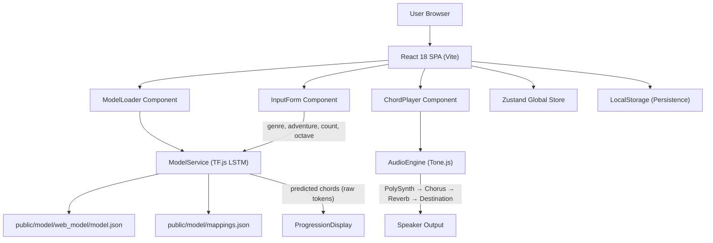
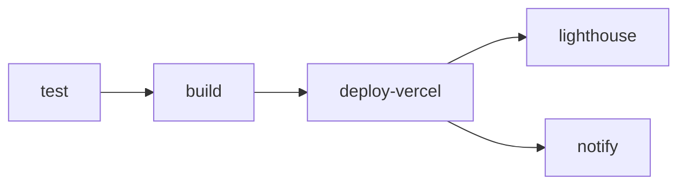
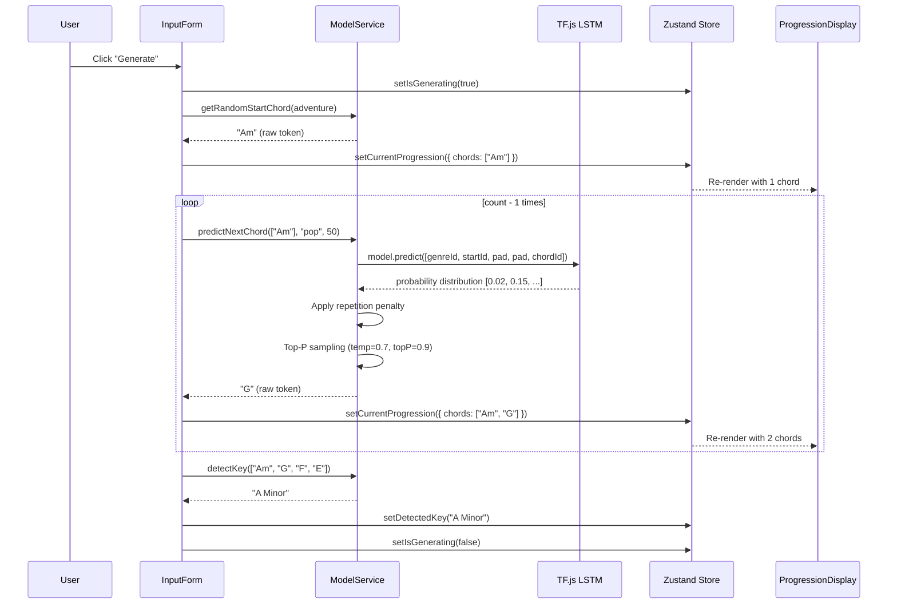
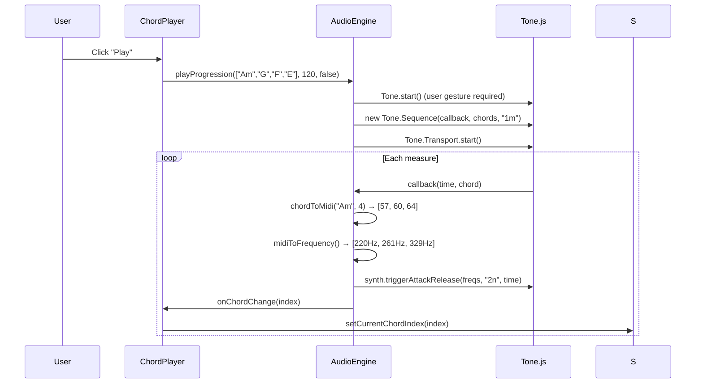

# ChordAI — Complete Project Deep Dive

> **An AI-powered chord progression generator** that runs entirely in the browser. Uses an LSTM neural network (trained on 600,000+ songs) via TensorFlow.js to generate genre-specific chord progressions, with real-time audio playback via Tone.js.

**Live URL:** `https://chordai.app` &nbsp;|&nbsp; **Repo:** `github.com/bufyyy/chordai`

---

## Table of Contents

1. [High-Level Architecture](#1-high-level-architecture)
2. [Technology Stack](#2-technology-stack)
3. [Directory Structure](#3-directory-structure)
4. [Entry Point & Bootstrap](#4-entry-point--bootstrap)
5. [AI Model System](#5-ai-model-system)
6. [Audio Engine](#6-audio-engine)
7. [State Management (Zustand)](#7-state-management-zustand)
8. [UI Components (React)](#8-ui-components-react)
9. [Utility Modules](#9-utility-modules)
10. [Data Layer](#10-data-layer)
11. [Custom Hooks](#11-custom-hooks)
12. [Styling & Design System](#12-styling--design-system)
13. [Testing Strategy](#13-testing-strategy)
14. [CI/CD Pipeline](#14-cicd-pipeline)
15. [Deployment & Infrastructure](#15-deployment--infrastructure)
16. [Configuration Files Reference](#16-configuration-files-reference)
17. [Key Data Flows](#17-key-data-flows)
18. [Known Quirks & Legacy Code](#18-known-quirks--legacy-code)

---

## 1. High-Level Architecture



The app is a **client-only SPA** — there is no backend server. The LSTM model runs entirely in-browser via TensorFlow.js. All persistence (history, favorites, settings) uses `localStorage`.

---

## 2. Technology Stack

| Layer | Technology | Version | Purpose |
|-------|-----------|---------|---------|
| **Framework** | React | 18.2 | UI rendering |
| **Build Tool** | Vite | 5.0 | Dev server & bundler |
| **AI/ML** | TensorFlow.js | 4.22 | In-browser LSTM inference |
| **Audio** | Tone.js | 14.7 | Web Audio API synth & playback |
| **Music Theory** | Tonal.js (`@tonaljs/tonal`) | 4.10 | Chord parsing & key detection |
| **State** | Zustand | 4.4 | Global state management |
| **CSS** | TailwindCSS | 3.3 | Utility-first styling |
| **Unit Testing** | Vitest + Testing Library | 3.2 / 16.3 | Component & utility tests |
| **E2E Testing** | Playwright | 1.56 | Cross-browser E2E tests |
| **Linting** | ESLint + Prettier | 9.37 / 3.6 | Code quality |
| **Deployment** | Vercel | — | Static hosting + CDN |
| **CI/CD** | GitHub Actions | — | Test → Build → Deploy pipeline |

---

## 3. Directory Structure

```
chordai_2nd_semester/
├── .github/workflows/
│   └── deploy.yml              # CI/CD pipeline (test → build → deploy → lighthouse)
├── .gitignore                  # Node, Python, model artifacts, IDE, temp files
├── LICENSE                     # MIT license
├── vercel.json                 # Vercel deployment config (caching headers, rewrites)
└── client/                     # ← ALL application code lives here
    ├── index.html              # SPA entry HTML (SEO meta, PWA manifest, OG tags, JSON-LD)
    ├── package.json            # Dependencies & npm scripts
    ├── vite.config.js          # Vite config (React plugin, port 3000)
    ├── vitest.config.js        # Vitest config (jsdom, coverage, path aliases)
    ├── tailwind.config.js      # TailwindCSS config (dark mode, custom colors)
    ├── postcss.config.js       # PostCSS (tailwind + autoprefixer)
    ├── playwright.config.js    # Playwright config (5 browser projects, webServer)
    ├── .eslintrc.json          # ESLint rules
    ├── .prettierrc             # Prettier config
    ├── .env.example            # Env var template
    ├── public/
    │   ├── manifest.json       # PWA manifest (icons, categories, screenshots)
    │   └── model/
    │       ├── mappings.json   # Token-to-integer vocab (37 KB, ~300+ tokens)
    │       └── web_model/
    │           └── model.json  # TF.js LSTM model (+ binary weight shards)
    ├── e2e/
    │   ├── user-flow.spec.js   # User interaction E2E tests
    │   └── complete-flow.spec.js # Full generation flow E2E tests
    └── src/
        ├── main.jsx            # React root render (StrictMode + ErrorBoundary)
        ├── App.jsx             # Root component (layout, routing, keyboard shortcuts)
        ├── index.css           # Global styles (Tailwind layers, animations, scrollbar, slider)
        ├── components/
        │   ├── ModelLoader.jsx         # Model loading screen with progress stages
        │   ├── InputForm.jsx           # Generation parameter controls
        │   ├── ProgressionDisplay.jsx  # Chord card grid with favorites/copy
        │   ├── ChordPlayer.jsx         # Audio playback controls & MIDI export
        │   ├── Sidebar.jsx             # Side panel (History + Favorites tabs)
        │   ├── HistoryPanel.jsx        # Progression history list
        │   ├── FavoritesPanel.jsx      # Favorited progressions with rename
        │   ├── Settings.jsx            # Settings modal (General, Audio, Data tabs)
        │   ├── ProgressionLibrary.jsx  # Famous progressions browser
        │   ├── Tutorial.jsx            # First-time onboarding wizard (4 steps)
        │   ├── Toast.jsx               # Toast notification system
        │   ├── ErrorBoundary.jsx       # React error boundary (class component)
        │   ├── LoadingSkeleton.jsx     # Skeleton loading placeholders
        │   ├── ProgressionDisplay.test.jsx
        │   └── Toast.test.jsx
        ├── services/
        │   ├── modelService.js         # TF.js model loading, prediction, sampling
        │   └── audioEngine.js          # Tone.js audio: synth, effects, MIDI export
        ├── store/
        │   └── useStore.js             # Zustand global store
        ├── hooks/
        │   ├── useKeyboardShortcuts.js # Global keyboard shortcut hook
        │   └── useKeyboardShortcuts.test.js
        ├── utils/
        │   ├── storage.js              # localStorage CRUD (history, favorites, settings)
        │   ├── exportUtils.js          # Export: TXT, JSON, MIDI, PNG, PDF, URL sharing
        │   ├── modelUtils.js           # Preprocessor class (legacy/alternative approach)
        │   ├── storage.test.js
        │   ├── exportUtils.test.js
        │   └── modelUtils.test.js
        ├── data/
        │   └── famousProgressions.js   # 25 famous chord progressions database
        └── test/
            └── setup.js                # Vitest global setup (mocks for Tone.js, TF.js, etc.)
```

---

## 4. Entry Point & Bootstrap

### [index.html](file:///c:/Personal%20files/CODING%20PROJECTS/chordai_2nd_semester/client/index.html)

The HTML entry point includes:
- **SEO**: Title, meta description, keywords, JSON-LD structured data (`WebApplication` schema)
- **Social sharing**: Open Graph and Twitter Card meta tags for `chordai.app`
- **PWA**: Manifest link, theme color `#1a1a2e`, apple-mobile-web-app-capable
- **Favicons**: SVG, PNG (32x32, 16x16), Apple Touch Icon
- **Google Fonts preconnect**: Connection hints for `fonts.googleapis.com`
- Dark mode class on `<html lang="en" class="dark">`

### [main.jsx](file:///c:/Personal%20files/CODING%20PROJECTS/chordai_2nd_semester/client/src/main.jsx)

```
React.StrictMode → ErrorBoundary → App
```

The root render wraps the entire app in [ErrorBoundary](file:///c:/Personal%20files/CODING%20PROJECTS/chordai_2nd_semester/client/src/components/ErrorBoundary.jsx#7-133) for graceful crash handling.

### [App.jsx](file:///c:/Personal%20files/CODING%20PROJECTS/chordai_2nd_semester/client/src/App.jsx) (295 lines)

The root component orchestrates the full UI:

- **Background**: Two animated gradient blobs (`bg-blue-500/10` and `bg-purple-500/10`) with `blur-3xl` and `animate-pulse-glow`
- **Demo Mode Banner**: Shown when `model === 'DEMO_MODE'` (yellow banner at top)
- **Global overlays**: [Toast](file:///c:/Personal%20files/CODING%20PROJECTS/chordai_2nd_semester/client/src/components/Toast.jsx#4-19), [Tutorial](file:///c:/Personal%20files/CODING%20PROJECTS/chordai_2nd_semester/client/src/components/Tutorial.jsx#4-176), [Settings](file:///c:/Personal%20files/CODING%20PROJECTS/chordai_2nd_semester/client/src/components/Settings.jsx#15-322) (modal), [ProgressionLibrary](file:///c:/Personal%20files/CODING%20PROJECTS/chordai_2nd_semester/client/src/components/ProgressionLibrary.jsx#5-175) (modal)
- **ModelLoader**: Full-screen loading overlay during model initialization
- **Sidebar**: History/Favorites panel
- **Main layout**: 3-column grid (`lg:grid-cols-3`)
  - Left (1 col): [InputForm](file:///c:/Personal%20files/CODING%20PROJECTS/chordai_2nd_semester/client/src/components/InputForm.jsx#5-244)
  - Right (2 cols): [ProgressionDisplay](file:///c:/Personal%20files/CODING%20PROJECTS/chordai_2nd_semester/client/src/components/ProgressionDisplay.jsx#36-247) + [ChordPlayer](file:///c:/Personal%20files/CODING%20PROJECTS/chordai_2nd_semester/client/src/components/ChordPlayer.jsx#5-320)
- **Footer**: "How it works" section (3 steps) + GitHub link
- **Keyboard shortcuts** (via [useKeyboardShortcuts](file:///c:/Personal%20files/CODING%20PROJECTS/chordai_2nd_semester/client/src/hooks/useKeyboardShortcuts.js#3-46)):
  - `Space` → Toggle play/stop
  - `L` → Open library
  - `Ctrl+S` → Open settings
  - `Escape` → Close modals
- **URL sharing**: On mount, checks for `?p=` query param to load shared progressions

---

## 5. AI Model System

### The LSTM Model

The neural network is a **pre-trained LSTM** (Long Short-Term Memory RNN) trained on the **Chordonomicon dataset** with 600,000+ songs. It was trained in Python using Keras, then converted to TensorFlow.js format.

**Model files** (in `public/model/`):
- `web_model/model.json` — TF.js model topology
- `web_model/group1-shard*.bin` — Binary weight shards
- [mappings.json](file:///c:/Personal%20files/CODING%20PROJECTS/chordai_2nd_semester/client/public/model/mappings.json) — Vocabulary: `{ token_to_int: { "<PAD>": 14, "<START>": 15, "<END>": 16, "<GENRE=pop>": 0, "C": 1, "Am": 2, ... } }`

### [modelService.js](file:///c:/Personal%20files/CODING%20PROJECTS/chordai_2nd_semester/client/src/services/modelService.js) (305 lines)

**Singleton class** (`modelService`) that handles all AI operations:

#### Loading ([loadModel()](file:///c:/Personal%20files/CODING%20PROJECTS/chordai_2nd_semester/client/src/components/ModelLoader.jsx#30-73))
1. Fetches [mappings.json](file:///c:/Personal%20files/CODING%20PROJECTS/chordai_2nd_semester/client/public/model/mappings.json) and `model.json` in parallel
2. Builds reverse mapping (`idToToken`)
3. Extracts available genres (tokens starting with `<GENRE=`)
4. Extracts chord vocabulary (all tokens NOT starting with `<`)
5. Flags `isLoaded = true`

#### Prediction ([predictNextChord(currentChords, genre, adventure)](file:///c:/Personal%20files/CODING%20PROJECTS/chordai_2nd_semester/client/src/services/modelService.js#77-195))

**Input construction** (sequence length = 5):
```
[genreId, START_ID, ...last3HistoryChords]  // padded to 5 total
```

**Steps:**
1. Maps genre string → `<GENRE=xxx>` → integer token ID
2. Maps existing chord names → integer IDs (uses PAD for unknown)
3. Takes last 3 chords from history (MAX_HISTORY = SEQUENCE_LENGTH - 2 = 3)
4. Constructs input: `[genreId, startId, chord1, chord2, chord3]`
5. Creates `tf.tensor2d` shape `[1, 5]`
6. Calls `model.predict()` — returns probability distribution
7. **Repetition penalty**: Hard-bans the last chord (sets probability to 0, renormalizes)
8. **Temperature scaling**: `temperature = 0.2 + (adventure / 100)`, range `[0.2, 1.2]`
9. **Top-P sampling** (`topP = 0.9`): Nucleus sampling from cumulative probability distribution

> **Return value**: Returns **RAW** vocabulary tokens (e.g., `"Fs"` not `"F#"`). This is critical — internal state uses raw tokens, display conversion happens separately.

#### Chord Display Formatting ([formatChordForDisplay(chord)](file:///c:/Personal%20files/CODING%20PROJECTS/chordai_2nd_semester/client/src/services/modelService.js#196-209))
Converts vocabulary notation to standard: `"Fs"` → `"F#"`, `"Cs"` → `"C#"`, but preserves `"sus"` (suspended chords).

```js
chord.replace(/^([A-G]b?)s(?!us)/, '$1#')
```

#### Random Start Chord ([getRandomStartChord(adventure)](file:///c:/Personal%20files/CODING%20PROJECTS/chordai_2nd_semester/client/src/services/modelService.js#252-285))
- `adventure < 30`: Only simple triads (regex `/^[A-G][bs]?(m)?$/`)
- `adventure < 70`: Adds 7ths, sus, dim
- `adventure ≥ 70`: All chords in vocabulary

#### Key Detection ([detectKey(chordList)](file:///c:/Personal%20files/CODING%20PROJECTS/chordai_2nd_semester/client/src/services/modelService.js#286-301))
Uses Tonal.js `Chord.get()` on the first chord to determine tonic and quality (Major/Minor).

### [modelUtils.js](file:///c:/Personal%20files/CODING%20PROJECTS/chordai_2nd_semester/client/src/utils/modelUtils.js) (312 lines)

> [!NOTE]
> This is a **legacy/alternative preprocessor** ([ChordProgressionPreprocessor](file:///c:/Personal%20files/CODING%20PROJECTS/chordai_2nd_semester/client/src/utils/modelUtils.js#12-222) class) designed for a different model architecture that used separate vocabulary files (`chord_vocab.json`, `genre_mapping.json`, etc.). It is **not actively used** by the current model pipeline — [modelService.js](file:///c:/Personal%20files/CODING%20PROJECTS/chordai_2nd_semester/client/src/services/modelService.js) handles everything directly. Kept for reference or future multi-model support.

Includes `ChordUtils` (chord parsing, quality detection, formatting) and [ModelError](file:///c:/Personal%20files/CODING%20PROJECTS/chordai_2nd_semester/client/src/utils/modelUtils.js#295-302) with error codes.

---

## 6. Audio Engine

### [audioEngine.js](file:///c:/Personal%20files/CODING%20PROJECTS/chordai_2nd_semester/client/src/services/audioEngine.js) (529 lines)

**Singleton class** exported via [getAudioEngine()](file:///c:/Personal%20files/CODING%20PROJECTS/chordai_2nd_semester/client/src/services/audioEngine.js#521-527).

#### Audio Signal Chain
```
PolySynth → Volume(-6dB) → Chorus(1.5Hz, depth 0.7) → Reverb(decay 2.5s, wet 0.3) → Destination
```

#### Synth Types (4 presets)

| Type | Oscillator | Attack | Decay | Sustain | Release | Note |
|------|-----------|--------|-------|---------|---------|------|
| **piano** | triangle | 0.008 | 0.3 | 0.1 | 2 | Default |
| **pad** | sawtooth | 0.5 | 0.3 | 0.8 | 3 | Atmospheric |
| **synth** | square | 0.02 | 0.2 | 0.3 | 1 | Retro |
| **electric** | FMSynth (harmonicity 3) | 0.01 | 0.3 | 0.2 | 1.5 | FM synthesis |

#### Chord-to-MIDI Conversion ([chordToMidi(chordName, octave)](file:///c:/Personal%20files/CODING%20PROJECTS/chordai_2nd_semester/client/src/services/audioEngine.js#153-242))

Parses chord name into root + quality, maps to intervals:

| Quality | Intervals |
|---------|-----------|
| Major (`""`, `"maj"`) | `[0, 4, 7]` |
| Minor (`"m"`, `"min"`) | `[0, 3, 7]` |
| Dom7 (`"7"`) | `[0, 4, 7, 10]` |
| Maj7 (`"maj7"`) | `[0, 4, 7, 11]` |
| Min7 (`"m7"`) | `[0, 3, 7, 10]` |
| sus2 | `[0, 2, 7]` |
| sus4 | `[0, 5, 7]` |
| dim | `[0, 3, 6]` |
| aug | `[0, 4, 8]` |
| *...13 more qualities* | — |

#### Playback System
- Uses `Tone.Sequence` with `1m` (one measure) per chord
- `Tone.Draw.schedule()` for UI-thread-safe chord index callbacks
- Loop mode toggling
- Automatic stop after last chord in non-loop mode (2s delay for release)

#### MIDI Export ([exportToMidi(chords, fileName)](file:///c:/Personal%20files/CODING%20PROJECTS/chordai_2nd_semester/client/src/services/audioEngine.js#382-409))
Builds raw MIDI binary data:
- Standard MIDI file header (Format 0, 1 track, 480 ticks/beat)
- Tempo meta event (500000 μs/qnote = 120 BPM)
- Note On/Off events for each chord voicing
- Variable-length encoding for delta times
- Downloads as `.mid` file via [Blob](file:///c:/Personal%20files/CODING%20PROJECTS/chordai_2nd_semester/client/src/services/audioEngine.js#483-489)

---

## 7. State Management (Zustand)

### [useStore.js](file:///c:/Personal%20files/CODING%20PROJECTS/chordai_2nd_semester/client/src/store/useStore.js) (127 lines)

Single flat Zustand store with all application state:

#### State Slices

| Slice | Fields | Notes |
|-------|--------|-------|
| **Model** | `model`, `preprocessor`, `isModelLoading`, `modelLoadProgress`, `modelError` | Track TF.js loading |
| **User Input** | `genre` (default `"pop"`), `adventure` (0-100, default 50), `octave` (default 4), `count` (default 4) | Active inputs |
| **Legacy** | `mood`, `key`, `scaleType`, `progressionLength`, `temperature` | Kept to avoid breaking ProgressionLibrary & History |
| **Progression** | `currentProgression`, `progressionHistory` (max 20), `isGenerating`, `detectedKey` | Current generation state |
| **Audio** | `isPlaying`, `tempo` (default 120), `currentChordIndex` | Playback state |
| **Toast** | `toasts[]` | Notification queue |
| **UI** | `isSettingsOpen`, `isLibraryOpen` | Modal visibility |

#### Key Helper
```js
getCurrentInput() → { genre, adventure, octave, count }
```

Toast system: [addToast({ type, message, duration? })](file:///c:/Personal%20files/CODING%20PROJECTS/chordai_2nd_semester/client/src/store/useStore.js#85-101) returns a unique ID. Auto-removal handled by [Toast](file:///c:/Personal%20files/CODING%20PROJECTS/chordai_2nd_semester/client/src/components/Toast.jsx#4-19) component.

---

## 8. UI Components (React)

### [ModelLoader.jsx](file:///c:/Personal%20files/CODING%20PROJECTS/chordai_2nd_semester/client/src/components/ModelLoader.jsx) (180 lines)

Full-screen overlay shown during model loading. Displays:
- Animated logo with `animate-pulse-glow`
- Progress bar (0% → 20% → 90% → 100%)
- 4 loading stages: "Initializing TensorFlow.js", "Loading vocabularies", "Loading neural network", "Warming up model"
- Error state with retry button
- Caching tip

Uses `modelService.loadModel()` internally and saves result to Zustand store. Prevents double-loading in React StrictMode with `mounted` flag.

### [InputForm.jsx](file:///c:/Personal%20files/CODING%20PROJECTS/chordai_2nd_semester/client/src/components/InputForm.jsx) (246 lines)

Main generation control panel with:

- **Start Chord input** (text, optional): User can type a chord name. Empty = random selection based on adventure level
- **Genre dropdown**: Dynamically populated from `modelService.genres` on mount
- **Adventure slider** (0-100): Controls sampling temperature. Labels: "Safe" / "Natural" / "Experimental"
- **Count** (1-16): How many chords to generate
- **Octave** (1-7): Playback octave
- **Generate button**: Triggers the generation loop

#### Generation Algorithm (in [handleGenerate](file:///c:/Personal%20files/CODING%20PROJECTS/chordai_2nd_semester/client/src/components/InputForm.jsx#44-103))
1. Determine start chord (user input or `modelService.getRandomStartChord(adventure)`)
2. Set progression immediately with first chord (UI shows progress)
3. Loop `count - 1` times, calling `modelService.predictNextChord(currentChords, genre, adventure)`
4. 100ms delay between each chord (animated appearance)
5. After loop, call `modelService.detectKey()` and set result

### [ProgressionDisplay.jsx](file:///c:/Personal%20files/CODING%20PROJECTS/chordai_2nd_semester/client/src/components/ProgressionDisplay.jsx) (249 lines)

Displays generated chords with:

- **ChordCard subcomponent**: Glassmorphism card per chord showing:
  - Chord index label ("Chord 1", etc.)
  - Chord name with musical symbols (♭, ♯) + octave number
  - Highlight ring when playing (`ring-4 ring-blue-500 scale-105`)
- **Action buttons**: Favorite (star toggle) + Copy to clipboard
- **Info badges**: Detected key (green gradient), Genre, Chord count
- **Notation bar**: Text view with arrow notation (`C4 → G4 → Am4 → F4`)
- **Auto-save**: Saves to localStorage history on every progression change
- **Favorite sync**: Checks [isInFavorites()](file:///c:/Personal%20files/CODING%20PROJECTS/chordai_2nd_semester/client/src/utils/storage.js#148-159) on progression ID changes

Empty state shows a music note icon with guidance text.

### [ChordPlayer.jsx](file:///c:/Personal%20files/CODING%20PROJECTS/chordai_2nd_semester/client/src/components/ChordPlayer.jsx) (322 lines)

Full playback control panel:

- **Play/Stop button**: Green gradient when stopped, red when playing
- **Loop toggle**: Purple when active
- **Progress indicator**: Animated bar + "Playing chord X of Y" text
- **Instrument selector**: 4 options (🎹 Piano, 🌊 Pad, 🎛️ Synth, ⚡ Electric)
- **Individual chord buttons**: Click to preview a single chord
- **Tempo slider**: 60-180 BPM
- **Volume slider**: -60dB to 0dB (displayed as 0%-100%)
- **Export MIDI button**: Downloads `.mid` file

Uses [getAudioEngine()](file:///c:/Personal%20files/CODING%20PROJECTS/chordai_2nd_semester/client/src/services/audioEngine.js#521-527) singleton. Sets up [onChordChange](file:///c:/Personal%20files/CODING%20PROJECTS/chordai_2nd_semester/client/src/components/ChordPlayer.jsx#25-29) and [onPlaybackEnd](file:///c:/Personal%20files/CODING%20PROJECTS/chordai_2nd_semester/client/src/components/ChordPlayer.jsx#30-34) callbacks on mount.

### [Sidebar.jsx](file:///c:/Personal%20files/CODING%20PROJECTS/chordai_2nd_semester/client/src/components/Sidebar.jsx) (96 lines)

Slide-in panel from right with tabs:
- **History tab** (blue) → [HistoryPanel](file:///c:/Personal%20files/CODING%20PROJECTS/chordai_2nd_semester/client/src/components/HistoryPanel.jsx#5-187)
- **Favorites tab** (yellow) → [FavoritesPanel](file:///c:/Personal%20files/CODING%20PROJECTS/chordai_2nd_semester/client/src/components/FavoritesPanel.jsx#5-236)
- Backdrop blur on mobile, 96-unit width on desktop

> [!NOTE]
> The Sidebar component receives `isOpen/onClose` props but in [App.jsx](file:///c:/Personal%20files/CODING%20PROJECTS/chordai_2nd_semester/client/src/App.jsx) it's rendered without passing these props. The Sidebar renders with `isOpen` as `undefined` and calls `if (!isOpen) return null;` — so the Sidebar **never actually renders** in the current code. This appears to be a bug or an incomplete refactor where the sidebar functionality moved to the Library modal.

### [HistoryPanel.jsx](file:///c:/Personal%20files/CODING%20PROJECTS/chordai_2nd_semester/client/src/components/HistoryPanel.jsx) (189 lines)

Lists saved progressions from `localStorage`:
- Shows chord badges, metadata (key, genre, mood), and relative timestamps ("5m ago", "2d ago")
- **Load** button restores progression to display + updates form inputs
- **Delete** button removes individual history items
- **Clear All** button with confirmation dialog

### [FavoritesPanel.jsx](file:///c:/Personal%20files/CODING%20PROJECTS/chordai_2nd_semester/client/src/components/FavoritesPanel.jsx) (238 lines)

Lists favorited progressions with additional features:
- **Rename** (inline edit with save/cancel)
- **Load** / **Remove** actions (appear on hover)
- Gradient-bordered chord badges
- Date formatting ("Jan 15, 2026")

### [Settings.jsx](file:///c:/Personal%20files/CODING%20PROJECTS/chordai_2nd_semester/client/src/components/Settings.jsx) (336 lines)

Modal with 3 tabs:

| Tab | Settings |
|-----|----------|
| **General** | Theme (Dark only, "Light coming soon"), Auto-save History toggle, Reset Tutorial |
| **Audio** | Audio Quality (High/Medium/Low), Default Tempo |
| **Data** | Storage usage (KB), Export All Data (JSON), Import Data, Clear History, Clear Favorites, Clear All Data |

Uses [SettingItem](file:///c:/Personal%20files/CODING%20PROJECTS/chordai_2nd_semester/client/src/components/Settings.jsx#323-334) sub-component for consistent label + control layout.

### [ProgressionLibrary.jsx](file:///c:/Personal%20files/CODING%20PROJECTS/chordai_2nd_semester/client/src/components/ProgressionLibrary.jsx) (234 lines)

Modal browser for famous chord progressions:
- **Search bar**: Filters by name, artist, or progression
- **Genre filter chips**: all, pop, rock, jazz, blues, rnb, edm, classical, progressive
- **ProgressionCard** grid (2 columns): Shows name, genre/mood badges, key, chord chips, example songs
- **Load button**: Sets progression + metadata into store, closes modal
- Footer shows "Showing X of 25 progressions"

### [Tutorial.jsx](file:///c:/Personal%20files/CODING%20PROJECTS/chordai_2nd_semester/client/src/components/Tutorial.jsx) (178 lines)

4-step onboarding wizard (shown once, on first visit):
1. **Welcome** — Introduction
2. **Choose Your Parameters** — Explains inputs
3. **Generate & Listen** — Explains workflow
4. **Save & Export** — Keyboard shortcuts info

Progress dots are clickable. Skip/Previous/Next buttons. Completion stored in `localStorage`.

### [Toast.jsx](file:///c:/Personal%20files/CODING%20PROJECTS/chordai_2nd_semester/client/src/components/Toast.jsx) (108 lines)

Notification system with 4 types: `success` (green), `error` (red), `warning` (yellow), `info` (blue). Auto-dismiss after `toast.duration` (default 3000ms). Positioned top-right with slide-in animation.

### [ErrorBoundary.jsx](file:///c:/Personal%20files/CODING%20PROJECTS/chordai_2nd_semester/client/src/components/ErrorBoundary.jsx) (135 lines)

React class component wrapper. Shows:
- Error icon + "Oops! Something went wrong"
- Expandable error details (dev mode only)
- "Try Again" (reset state) and "Reload Page" buttons
- GitHub issues link

### [LoadingSkeleton.jsx](file:///c:/Personal%20files/CODING%20PROJECTS/chordai_2nd_semester/client/src/components/LoadingSkeleton.jsx) (96 lines)

6 skeleton variants: [CardSkeleton](file:///c:/Personal%20files/CODING%20PROJECTS/chordai_2nd_semester/client/src/components/LoadingSkeleton.jsx#6-15), [ChordSkeleton](file:///c:/Personal%20files/CODING%20PROJECTS/chordai_2nd_semester/client/src/components/LoadingSkeleton.jsx#16-23), [ProgressionSkeleton](file:///c:/Personal%20files/CODING%20PROJECTS/chordai_2nd_semester/client/src/components/LoadingSkeleton.jsx#24-41), [FormSkeleton](file:///c:/Personal%20files/CODING%20PROJECTS/chordai_2nd_semester/client/src/components/LoadingSkeleton.jsx#42-55), [PlayerSkeleton](file:///c:/Personal%20files/CODING%20PROJECTS/chordai_2nd_semester/client/src/components/LoadingSkeleton.jsx#56-74), [ListSkeleton](file:///c:/Personal%20files/CODING%20PROJECTS/chordai_2nd_semester/client/src/components/LoadingSkeleton.jsx#75-87). All use Tailwind's `animate-pulse` with gray placeholder shapes.

---

## 9. Utility Modules

### [storage.js](file:///c:/Personal%20files/CODING%20PROJECTS/chordai_2nd_semester/client/src/utils/storage.js) (357 lines)

localStorage CRUD operations. Storage keys:
- `chordai_history` — Array of up to 20 progression objects
- `chordai_favorites` — Array of favorited progressions with custom names
- `chordai_settings` — User preferences JSON
- `chordai_onboarding_completed` — Boolean flag

**Default settings:**
```js
{ theme: 'dark', audioQuality: 'high', defaultGenre: 'pop', defaultMood: 'uplifting',
  defaultKey: 'C', defaultScaleType: 'major', defaultLength: 4, defaultTemperature: 1.0,
  defaultTempo: 120, autoSaveHistory: true, showTutorial: true }
```

Functions: [saveToHistory](file:///c:/Personal%20files/CODING%20PROJECTS/chordai_2nd_semester/client/src/utils/storage.js#15-48), [getHistory](file:///c:/Personal%20files/CODING%20PROJECTS/chordai_2nd_semester/client/src/utils/storage.js#49-61), [clearHistory](file:///c:/Personal%20files/CODING%20PROJECTS/chordai_2nd_semester/client/src/utils/storage.js#62-74), [deleteHistoryItem](file:///c:/Personal%20files/CODING%20PROJECTS/chordai_2nd_semester/client/src/utils/storage.js#75-89), [saveToFavorites](file:///c:/Personal%20files/CODING%20PROJECTS/chordai_2nd_semester/client/src/utils/storage.js#90-119), [getFavorites](file:///c:/Personal%20files/CODING%20PROJECTS/chordai_2nd_semester/client/src/utils/storage.js#120-132), [removeFromFavorites](file:///c:/Personal%20files/CODING%20PROJECTS/chordai_2nd_semester/client/src/utils/storage.js#133-147), [isInFavorites](file:///c:/Personal%20files/CODING%20PROJECTS/chordai_2nd_semester/client/src/utils/storage.js#148-159), [clearFavorites](file:///c:/Personal%20files/CODING%20PROJECTS/chordai_2nd_semester/client/src/utils/storage.js#160-172), [saveSettings](file:///c:/Personal%20files/CODING%20PROJECTS/chordai_2nd_semester/client/src/utils/storage.js#173-185), [getSettings](file:///c:/Personal%20files/CODING%20PROJECTS/chordai_2nd_semester/client/src/utils/storage.js#186-198), [updateSetting](file:///c:/Personal%20files/CODING%20PROJECTS/chordai_2nd_semester/client/src/utils/storage.js#218-231), [isOnboardingCompleted](file:///c:/Personal%20files/CODING%20PROJECTS/chordai_2nd_semester/client/src/utils/storage.js#232-242), [completeOnboarding](file:///c:/Personal%20files/CODING%20PROJECTS/chordai_2nd_semester/client/src/utils/storage.js#243-255), [resetOnboarding](file:///c:/Personal%20files/CODING%20PROJECTS/chordai_2nd_semester/client/src/utils/storage.js#256-268), [exportAllData](file:///c:/Personal%20files/CODING%20PROJECTS/chordai_2nd_semester/client/src/utils/storage.js#269-280), [importData](file:///c:/Personal%20files/CODING%20PROJECTS/chordai_2nd_semester/client/src/utils/storage.js#281-301), [clearAllData](file:///c:/Personal%20files/CODING%20PROJECTS/chordai_2nd_semester/client/src/utils/storage.js#302-316), [getStorageUsage](file:///c:/Personal%20files/CODING%20PROJECTS/chordai_2nd_semester/client/src/utils/storage.js#317-334)

### [exportUtils.js](file:///c:/Personal%20files/CODING%20PROJECTS/chordai_2nd_semester/client/src/utils/exportUtils.js) (434 lines)

Multiple export formats:

| Format | Function | Notes |
|--------|----------|-------|
| **TXT** | [exportAsTxt()](file:///c:/Personal%20files/CODING%20PROJECTS/chordai_2nd_semester/client/src/utils/exportUtils.js#6-34) / [downloadAsTxt()](file:///c:/Personal%20files/CODING%20PROJECTS/chordai_2nd_semester/client/src/utils/exportUtils.js#57-65) | Formatted text with metadata |
| **JSON** | [exportAsJson()](file:///c:/Personal%20files/CODING%20PROJECTS/chordai_2nd_semester/client/src/utils/exportUtils.js#35-41) / [downloadAsJson()](file:///c:/Personal%20files/CODING%20PROJECTS/chordai_2nd_semester/client/src/utils/exportUtils.js#66-74) | Pretty-printed JSON |
| **MIDI** | [exportAsMidi()](file:///c:/Personal%20files/CODING%20PROJECTS/chordai_2nd_semester/client/src/utils/exportUtils.js#75-96) | Placeholder (downloads JSON with `.mid.json` extension) |
| **PNG** | [exportAsPng()](file:///c:/Personal%20files/CODING%20PROJECTS/chordai_2nd_semester/client/src/utils/exportUtils.js#207-319) | Canvas-rendered image (1200×630) with gradient background, chord boxes, metadata |
| **PDF** | [exportAsPdf()](file:///c:/Personal%20files/CODING%20PROJECTS/chordai_2nd_semester/client/src/utils/exportUtils.js#320-420) | Canvas-rendered A4 image (2480×3508) for printing |
| **URL** | [generateShareUrl()](file:///c:/Personal%20files/CODING%20PROJECTS/chordai_2nd_semester/client/src/utils/exportUtils.js#97-118) / [decodeProgressionFromUrl()](file:///c:/Personal%20files/CODING%20PROJECTS/chordai_2nd_semester/client/src/utils/exportUtils.js#119-146) | Base64-encoded JSON in `?p=` query parameter |
| **Clipboard** | [copyShareUrl()](file:///c:/Personal%20files/CODING%20PROJECTS/chordai_2nd_semester/client/src/utils/exportUtils.js#147-179) / [copyChords()](file:///c:/Personal%20files/CODING%20PROJECTS/chordai_2nd_semester/client/src/utils/exportUtils.js#180-206) | With fallback for older browsers |

> [!IMPORTANT]
> The actual MIDI export in [audioEngine.js](file:///c:/Personal%20files/CODING%20PROJECTS/chordai_2nd_semester/client/src/services/audioEngine.js) ([exportToMidi](file:///c:/Personal%20files/CODING%20PROJECTS/chordai_2nd_semester/client/src/services/audioEngine.js#382-409)) creates real MIDI binary data and works correctly. The [exportAsMidi](file:///c:/Personal%20files/CODING%20PROJECTS/chordai_2nd_semester/client/src/utils/exportUtils.js#75-96) in [exportUtils.js](file:///c:/Personal%20files/CODING%20PROJECTS/chordai_2nd_semester/client/src/utils/exportUtils.js) is a placeholder that just wraps JSON — it's not typically called by the UI.

---

## 10. Data Layer

### [famousProgressions.js](file:///c:/Personal%20files/CODING%20PROJECTS/chordai_2nd_semester/client/src/data/famousProgressions.js) (323 lines)

A curated database of **25 famous chord progressions** across genres:

- **Pop** (5): Axis of Awesome I-V-vi-IV, Sensitive Female, vi-IV-I-V, 50s Progression, I-IV-vi-V
- **Rock** (3): I-IV-V Classic Rock, I-bVII-IV Mixolydian, I-bVII-bVI-bVII
- **Blues** (2): 12-Bar Blues, Simple Blues
- **Jazz** (3): ii-V-I Turnaround, Rhythm Changes, iii-vi-ii-V-I
- **Minor** (4): Andalusian Cadence, i-bVI-bVII, Minor Blues, i-iv-bVII-bVI
- **R&B** (2): I-iii-IV-V, Imaj7-IVmaj7-iii7-vi7
- **EDM** (2): I-V-vi-iii, Epic EDM
- **Classical** (2): Authentic Cadence, Minor Authentic
- **Alternative** (2): I-V-IV Nirvana-style, I-bIII-bVII-IV Radiohead-style

Each entry has: [id](file:///c:/Personal%20files/CODING%20PROJECTS/chordai_2nd_semester/client/src/components/Sidebar.jsx#5-94), `name`, `chords[]`, `romanNumerals[]`, `key`, `scaleType`, `genre`, `mood`, `songs[]`.

Helper functions: [getProgressionsByGenre()](file:///c:/Personal%20files/CODING%20PROJECTS/chordai_2nd_semester/client/src/data/famousProgressions.js#301-304), [getProgressionsByMood()](file:///c:/Personal%20files/CODING%20PROJECTS/chordai_2nd_semester/client/src/data/famousProgressions.js#305-308), [getProgressionById()](file:///c:/Personal%20files/CODING%20PROJECTS/chordai_2nd_semester/client/src/data/famousProgressions.js#309-312), [searchProgressions()](file:///c:/Personal%20files/CODING%20PROJECTS/chordai_2nd_semester/client/src/data/famousProgressions.js#313-323).

### Model Vocabulary ([mappings.json](file:///c:/Personal%20files/CODING%20PROJECTS/chordai_2nd_semester/client/public/model/mappings.json))

Located at [public/model/mappings.json](file:///c:/Personal%20files/CODING%20PROJECTS/chordai_2nd_semester/client/public/model/mappings.json) (37 KB). Structure:
```json
{
  "token_to_int": {
    "<PAD>": 14,
    "<START>": 15,
    "<END>": 16,
    "<GENRE=pop>": 0,
    "<GENRE=rock>": 1,
    "C": 17,
    "Am": 18,
    "Fs": 19,
    ...
  }
}
```

Tokens include: special tokens (`<PAD>`, `<START>`, `<END>`), genre tokens (`<GENRE=pop>`, `<GENRE=rock>`, etc.), and chord tokens using vocabulary notation (e.g., `"Fs"` for F#, `"Cs"` for C#).

---

## 11. Custom Hooks

### [useKeyboardShortcuts.js](file:///c:/Personal%20files/CODING%20PROJECTS/chordai_2nd_semester/client/src/hooks/useKeyboardShortcuts.js) (48 lines)

Global keyboard listener hook. Features:
- **Input guard**: Ignores shortcuts when user is typing in `<input>`, `<textarea>`, or `contentEditable`
- **Modifier keys**: Supports `ctrl/cmd`, `shift`, `alt` modifiers
- **Pattern**: Takes array of `{ key, ctrl?, shift?, alt?, action }` objects
- `event.preventDefault()` on match

Used in [App.jsx](file:///c:/Personal%20files/CODING%20PROJECTS/chordai_2nd_semester/client/src/App.jsx) for Space, L, Ctrl+S, and Escape shortcuts.

---

## 12. Styling & Design System

### Design Language
- **Theme**: Dark glassmorphism with purple/blue gradients
- **Background**: `bg-gradient-to-br from-gray-900 via-purple-900/20 to-gray-900`
- **Glass effect**: `bg-white/10 backdrop-blur-md border border-white/20`
- **Accent gradients**: Blue-to-purple (`from-blue-400 to-purple-600`)
- **Font**: Inter (Google Fonts) with system fallbacks

### Custom CSS Classes (from [index.css](file:///c:/Personal%20files/CODING%20PROJECTS/chordai_2nd_semester/client/src/index.css))

| Class | Purpose |
|-------|---------|
| `.glass` | Glassmorphism effect (white/10 bg + backdrop-blur + border) |
| `.glass-darker` | Darker glass variant (white/5) |
| `.glass-hover` | Hover state for glass elements |
| `.gradient-bg` | Linear gradient background (#667eea → #764ba2) |
| `.gradient-text` | Gradient text (blue-400 → purple-600) |
| `.input` | Form input styling |

### Custom Animations (7 total)

| Animation | Duration | Effect |
|-----------|----------|--------|
| `animate-fade-in` | 0.5s | Fade in + slide up 10px |
| `animate-scale-in` | 0.3s | Fade in + scale from 0.95 |
| `animate-slide-in-right` | 0.3s | Slide in from +50px right |
| `animate-slide-in-left` | 0.3s | Slide in from -50px left |
| `animate-pulse-glow` | 2s infinite | Box-shadow pulsing (indigo glow) |
| `animate-bounce-subtle` | 1s infinite | Subtle 5px bounce |
| `animate-spin-slow` | 3s linear infinite | Slow rotation |

### Custom Scrollbar & Slider Styling
- WebKit scrollbar: 8px width, gray-800 track, gray-600 thumb
- `.custom-scrollbar`: 6px transparent scrollbar for panels
- Range input `.slider`: Custom thumb with gradient + glow shadow

### TailwindCSS Config

Extended with:
- `primary` color scale (blue-based, 50-900)
- `gradient-radial` and `gradient-conic` background images
- `backdrop-blur-xs` (2px)
- `darkMode: 'class'`

---

## 13. Testing Strategy

### Unit Tests (Vitest)

| Test File | What It Tests |
|-----------|--------------|
| [ProgressionDisplay.test.jsx](file:///c:/Personal%20files/CODING%20PROJECTS/chordai_2nd_semester/client/src/components/ProgressionDisplay.test.jsx) | Component rendering, chord display, favorites toggle, copy functionality |
| [Toast.test.jsx](file:///c:/Personal%20files/CODING%20PROJECTS/chordai_2nd_semester/client/src/components/Toast.test.jsx) | Toast rendering, auto-dismiss, different types |
| [audioEngine.test.js](file:///c:/Personal%20files/CODING%20PROJECTS/chordai_2nd_semester/client/src/services/audioEngine.test.js) | AudioEngine class methods, chord-to-MIDI conversion, MIDI export |
| [useKeyboardShortcuts.test.js](file:///c:/Personal%20files/CODING%20PROJECTS/chordai_2nd_semester/client/src/hooks/useKeyboardShortcuts.test.js) | Shortcut registration, input focus guard, modifier key handling |
| [storage.test.js](file:///c:/Personal%20files/CODING%20PROJECTS/chordai_2nd_semester/client/src/utils/storage.test.js) | All localStorage CRUD operations, edge cases |
| [exportUtils.test.js](file:///c:/Personal%20files/CODING%20PROJECTS/chordai_2nd_semester/client/src/utils/exportUtils.test.js) | Export formats, URL encoding/decoding, clipboard operations |
| [modelUtils.test.js](file:///c:/Personal%20files/CODING%20PROJECTS/chordai_2nd_semester/client/src/utils/modelUtils.test.js) | ChordProgressionPreprocessor, ChordUtils, temperature sampling |

**Config** ([vitest.config.js](file:///c:/Personal%20files/CODING%20PROJECTS/chordai_2nd_semester/client/vitest.config.js)):
- Environment: `jsdom`
- Globals: `true` (no imports needed for `describe`, [it](file:///c:/Personal%20files/CODING%20PROJECTS/chordai_2nd_semester/client/src/utils/modelUtils.js#257-264), `expect`)
- Setup file mocks: Tone.js, TensorFlow.js, Web Audio API, localStorage
- Coverage: v8 provider, text + json + html reporters
- Path alias: `@` → `./src`

### E2E Tests (Playwright)

| Test File | Scenarios |
|-----------|-----------|
| [user-flow.spec.js](file:///c:/Personal%20files/CODING%20PROJECTS/chordai_2nd_semester/client/e2e/user-flow.spec.js) | User interaction flows |
| [complete-flow.spec.js](file:///c:/Personal%20files/CODING%20PROJECTS/chordai_2nd_semester/client/e2e/complete-flow.spec.js) | Full generation & playback flows |

**Config** ([playwright.config.js](file:///c:/Personal%20files/CODING%20PROJECTS/chordai_2nd_semester/client/playwright.config.js)):
- 5 browser projects: Chromium, Firefox, WebKit, Mobile Chrome (Pixel 5), Mobile Safari (iPhone 12)
- Auto-starts dev server (`npm run dev`) on port 3000
- Screenshots on failure, traces on first retry
- 2 retries in CI, 1 worker in CI

### NPM Scripts
```bash
npm run test           # Vitest (watch mode)
npm run test:ui        # Vitest UI
npm run test:coverage  # Vitest with coverage
npm run test:e2e       # Playwright
npm run test:e2e:ui    # Playwright UI
```

---

## 14. CI/CD Pipeline

### [deploy.yml](file:///c:/Personal%20files/CODING%20PROJECTS/chordai_2nd_semester/.github/workflows/deploy.yml) (161 lines)

**Triggers**: Push to `main`, Pull requests to `main`



| Job | Steps |
|-----|-------|
| **test** | Checkout → Node 18 setup → `npm ci` → Lint → Unit tests → Playwright install → E2E tests → Upload coverage to Codecov |
| **build** | `npm run build` (production) → Check build size → Upload dist artifact (7-day retention) |
| **deploy-vercel** | Download dist → Deploy via `amondnet/vercel-action` with `--prod` flag (main branch only) |
| **lighthouse** | Run Lighthouse CI against deployed URL → Upload results (main branch only) |
| **notify** | Slack notification with deployment status (always runs on main) |

**Required secrets**: `VERCEL_TOKEN`, `VERCEL_ORG_ID`, `VERCEL_PROJECT_ID`, `SLACK_WEBHOOK`

---

## 15. Deployment & Infrastructure

### [vercel.json](file:///c:/Personal%20files/CODING%20PROJECTS/chordai_2nd_semester/vercel.json)

- **Framework**: Vite
- **Build**: `npm run build` → `dist/`
- **SPA Rewrite**: `/(.*) → /index.html` (all routes serve the SPA)
- **Aggressive caching** (1 year, immutable):
  - `/model/*` — TF.js model files
  - `*.js`, `*.css` — Bundled assets
  - Images (png, jpg, svg, webp, etc.)
- **Env vars**: `NODE_ENV=production`, `VITE_APP_NAME=ChordAI`, `VITE_APP_VERSION=1.0.0`

### PWA Support

[manifest.json](file:///c:/Personal%20files/CODING%20PROJECTS/chordai_2nd_semester/client/public/manifest.json) defines:
- Display: `standalone`
- Orientation: `portrait-primary`
- 8 icon sizes (72–512px, `any maskable`)
- Categories: music, utilities, productivity
- 2 screenshot entries

---

## 16. Configuration Files Reference

| File | Purpose |
|------|---------|
| [vite.config.js](file:///c:/Personal%20files/CODING%20PROJECTS/chordai_2nd_semester/client/vite.config.js) | React plugin, dev port 3000, output to `dist/` |
| [vitest.config.js](file:///c:/Personal%20files/CODING%20PROJECTS/chordai_2nd_semester/client/vitest.config.js) | jsdom environment, v8 coverage, `@` alias |
| [tailwind.config.js](file:///c:/Personal%20files/CODING%20PROJECTS/chordai_2nd_semester/client/tailwind.config.js) | Dark mode class, primary colors, gradient utilities |
| [postcss.config.js](file:///c:/Personal%20files/CODING%20PROJECTS/chordai_2nd_semester/client/postcss.config.js) | tailwind + autoprefixer |
| [playwright.config.js](file:///c:/Personal%20files/CODING%20PROJECTS/chordai_2nd_semester/client/playwright.config.js) | 5 browsers, auto webServer, CI config |
| [.eslintrc.json](file:///c:/Personal%20files/CODING%20PROJECTS/chordai_2nd_semester/client/.eslintrc.json) | React + React Hooks + Prettier rules |
| [.prettierrc](file:///c:/Personal%20files/CODING%20PROJECTS/chordai_2nd_semester/client/.prettierrc) | Single quotes, trailing commas, 100 print width |
| [.lintstagedrc.json](file:///c:/Personal%20files/CODING%20PROJECTS/chordai_2nd_semester/client/.lintstagedrc.json) | Pre-commit lint-staged config |
| [.env.example](file:///c:/Personal%20files/CODING%20PROJECTS/chordai_2nd_semester/client/.env.example) | Template: analytics, Sentry, feature flags, model path |

---

## 17. Key Data Flows

### Chord Generation Flow



### Audio Playback Flow



### Persistence Flow

```
Generate Progression
  └→ ProgressionDisplay auto-saves to localStorage (history)
  └→ User clicks ⭐ → saveToFavorites() → localStorage

Settings change → updateSetting() → localStorage
Data export → exportAllData() → JSON file download
Data import → importData() → localStorage → page reload
```

---

## 18. Known Quirks & Legacy Code

1. **Sidebar never renders**: [App.jsx](file:///c:/Personal%20files/CODING%20PROJECTS/chordai_2nd_semester/client/src/App.jsx) renders `<Sidebar />` without passing `isOpen`/`onClose` props. Since [Sidebar](file:///c:/Personal%20files/CODING%20PROJECTS/chordai_2nd_semester/client/src/components/Sidebar.jsx#5-94) returns `null` when `!isOpen`, it never shows. History/Favorites are accessible through the Library modal and Settings instead.

2. **Legacy state fields**: [useStore.js](file:///c:/Personal%20files/CODING%20PROJECTS/chordai_2nd_semester/client/src/store/useStore.js) keeps `mood`, `key`, `scaleType`, `progressionLength`, `temperature` — these are not used by the current model pipeline (which only needs `genre` + `adventure`) but are referenced by [ProgressionLibrary](file:///c:/Personal%20files/CODING%20PROJECTS/chordai_2nd_semester/client/src/components/ProgressionLibrary.jsx#5-175) and [HistoryPanel](file:///c:/Personal%20files/CODING%20PROJECTS/chordai_2nd_semester/client/src/components/HistoryPanel.jsx#5-187) when loading library progressions.

3. **Dual MIDI export**: [audioEngine.js](file:///c:/Personal%20files/CODING%20PROJECTS/chordai_2nd_semester/client/src/services/audioEngine.js) has a working MIDI export, while [exportUtils.js](file:///c:/Personal%20files/CODING%20PROJECTS/chordai_2nd_semester/client/src/utils/exportUtils.js) has a placeholder MIDI export (just wraps JSON). The UI uses the audioEngine version.

4. **modelUtils.js unused**: The [ChordProgressionPreprocessor](file:///c:/Personal%20files/CODING%20PROJECTS/chordai_2nd_semester/client/src/utils/modelUtils.js#12-222) class was designed for a different model architecture with separate vocabulary files. The current pipeline uses [modelService.js](file:///c:/Personal%20files/CODING%20PROJECTS/chordai_2nd_semester/client/src/services/modelService.js) directly with a single [mappings.json](file:///c:/Personal%20files/CODING%20PROJECTS/chordai_2nd_semester/client/public/model/mappings.json).

5. **Raw vs Display chord format**: Internally, chords use vocabulary notation (`"Fs"` for F#, `"Cs"` for C#). [formatChordForDisplay()](file:///c:/Personal%20files/CODING%20PROJECTS/chordai_2nd_semester/client/src/services/modelService.js#196-209) converts for UI. All model operations must use raw tokens — passing display-formatted chords breaks vocabulary lookups.

6. **Hardcoded sequence length**: The model expects exactly 5 input tokens: `[genre, start, chord, chord, chord]`. This is hardcoded in [modelService.js](file:///c:/Personal%20files/CODING%20PROJECTS/chordai_2nd_semester/client/src/services/modelService.js) as `SEQUENCE_LENGTH = 5`.

7. **Demo mode**: The store supports `model === 'DEMO_MODE'` with a banner, but no code currently sets this value — it's a hook for future offline/demo functionality.

8. **Light theme placeholder**: Settings offers "Light (Coming soon)" but only dark mode is implemented.

---

> **Last analyzed**: March 16, 2026 &nbsp;|&nbsp; **Total source files**: ~35 &nbsp;|&nbsp; **Total lines of code**: ~6,500+
