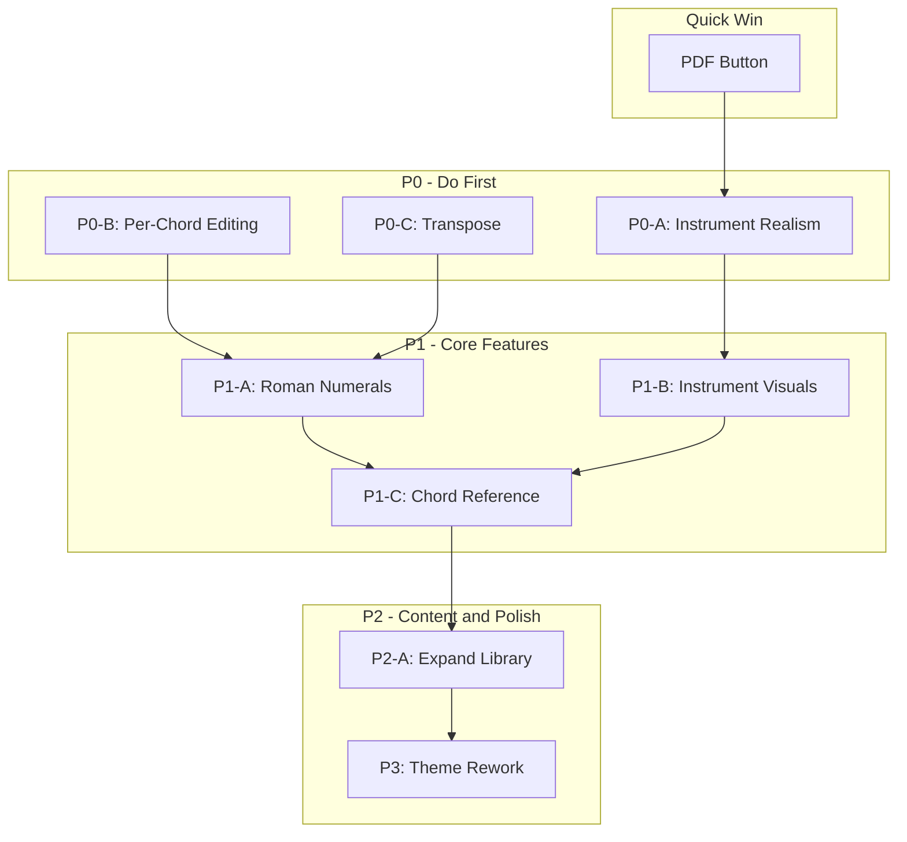

# ChordAI Backlog -- Detailed Implementation Guide

---

## PDF Export Button (Quick Win -- do first)

**Goal:** Add a visible "Export as PDF" button next to the existing copy/favorite actions.

**File:** [client/src/components/ProgressionDisplay.jsx](client/src/components/ProgressionDisplay.jsx)

**Steps:**

1. At the top of the file, add the import:
```jsx
import { exportAsPdf } from '../utils/exportUtils';
```

2. Add a handler inside `ProgressionDisplay`:
```jsx
const handleExportPdf = () => {
  exportAsPdf({
    chords,
    metadata,
    romanNumerals: currentProgression?.romanNumerals,
  });
  showToastNotification('PDF exported!');
};
```

3. Add a button inside the `<div className="flex gap-2">` block (line 175), after the copy button (after line 217). Use the same pattern as the existing copy button but with a download icon and `onClick={handleExportPdf}`.

4. `exportAsPdf` already exists and works in [client/src/utils/exportUtils.js](client/src/utils/exportUtils.js) (line 304). It uses `jsPDF` which is already in `package.json`. No new dependencies needed.

---

## P0-A: Fix Instrument Realism

**Goal:** Replace the fake piano with a Sampler, add organ/strings presets.

**File:** [client/src/services/audioEngine.js](client/src/services/audioEngine.js)

### Step 1: Download Salamander Piano Samples

- Get samples from https://github.com/nbrosowsky/tonern-tonejs/tree/master/Salamander (or use the Tone.js CDN URL: `https://tonejs.github.io/audio/salamander/`).
- You only need roughly 12 samples (one per semitone, e.g., A1.mp3 through G#6.mp3). Tone.Sampler interpolates the rest.
- Place files in `client/public/samples/piano/` OR use the CDN URL directly in code.

### Step 2: Modify `createSynth()` (line 99)

The method currently has a `switch` on `type`. You need to:

- Change `createSynth` to `async createSynth` since `Tone.Sampler` loads asynchronously.
- Add a class property `this.samplerLoaded = false` in the constructor.
- Replace the `'piano'` case with:

```jsx
case 'acoustic-piano':
  this.samplerLoaded = false;
  this.synth = new Tone.Sampler({
    urls: {
      A1: 'A1.mp3', A2: 'A2.mp3', /* ... one per octave ... */
    },
    baseUrl: 'https://tonejs.github.io/audio/salamander/',
    onload: () => { this.samplerLoaded = true; },
  }).connect(this.volume);
  break;
```

- Rename the current `'piano'` case to `'electric-piano'` (it already sounds like an EP).
- Add new cases for `'organ'` and `'strings'`:

```jsx
case 'organ':
  this.synth = new Tone.PolySynth(Tone.Synth, {
    oscillator: { type: 'sine', partialCount: 3 },
    envelope: { attack: 0.05, decay: 0.1, sustain: 0.9, release: 0.4 },
  }).connect(this.volume);
  break;

case 'strings':
  this.synth = new Tone.PolySynth(Tone.Synth, {
    oscillator: { type: 'sawtooth' },
    envelope: { attack: 0.8, decay: 0.3, sustain: 0.7, release: 3.0 },
  }).connect(this.volume);
  break;
```

- Keep `'pad'`, `'synth'` (rename to `'synth-lead'`), and `'electric'` as they are.

### Step 3: Make `changeSynthType` async-aware (line 175)

`changeSynthType` already calls `this.createSynth(type)`. Since `createSynth` is now async, await it:
```jsx
async changeSynthType(type) {
  await this.initialize();
  await this.createSynth(type);
}
```

### Step 4: Guard playback for sampler loading

In `playChord()` (line 289) and `playProgression()` (line 301), add an early check:
```jsx
if (this.currentSynthType === 'acoustic-piano' && !this.samplerLoaded) {
  console.warn('Sampler still loading...');
  return;
}
```

### Step 5: Update the UI in ChordPlayer.jsx

**File:** [client/src/components/ChordPlayer.jsx](client/src/components/ChordPlayer.jsx)

Update the `synthTypes` array (line 114):
```jsx
const synthTypes = [
  { value: 'acoustic-piano', label: 'Piano', icon: '🎹' },
  { value: 'electric-piano', label: 'EP', icon: '🎹' },
  { value: 'pad', label: 'Pad', icon: '🌊' },
  { value: 'organ', label: 'Organ', icon: '⛪' },
  { value: 'strings', label: 'Strings', icon: '🎻' },
  { value: 'synth-lead', label: 'Synth', icon: '🎛️' },
  { value: 'electric', label: 'Electric', icon: '⚡' },
];
```

Change the grid on line 205 from `grid-cols-4` to a scrollable row:
```jsx
<div className="flex gap-2 overflow-x-auto pb-2">
```

Also update the default `useState('piano')` on line 17 to `useState('acoustic-piano')` and the `currentSynthType` default in `audioEngine.js` constructor (line 16) to `'acoustic-piano'`.

---

## P0-B: Per-Chord Editing

**Goal:** Click a chord card to swap it with another chord from the vocabulary.

### Step 1: Add `replaceChord` action to the store

**File:** [client/src/store/useStore.js](client/src/store/useStore.js)

Add after `clearProgression` (line 73):
```jsx
replaceChord: (index, newChord) => {
  const state = get();
  const prog = state.currentProgression;
  if (!prog || !prog.chords) return;
  const updatedChords = [...prog.chords];
  updatedChords[index] = newChord;
  set({
    currentProgression: { ...prog, chords: updatedChords },
  });
},
```

### Step 2: Create `ChordPicker.jsx`

**New file:** `client/src/components/ChordPicker.jsx`

This is a dropdown/popover that appears when a chord card is clicked:

- Import `modelService` to access `modelService.chords` (the ~279 tokens from the vocabulary).
- Render a text `<input>` for filtering. Filter `modelService.chords` by the typed string.
- Display filtered results as a scrollable list (max-height ~200px). Group by root note for browsability: extract the root with a regex like `/^[A-G][bs]?/`.
- Each result row shows `modelService.formatChordForDisplay(chord)` (display form) but stores the raw token.
- On click of a result, call a prop `onSelect(rawChord)`. On click-away or Escape, call `onCancel()`.

Structure:
```jsx
function ChordPicker({ currentChord, onSelect, onCancel }) {
  const [filter, setFilter] = useState('');
  const allChords = modelService.chords || [];
  const filtered = allChords.filter(c =>
    modelService.formatChordForDisplay(c).toLowerCase().includes(filter.toLowerCase())
  );
  // ... render input + list
}
```

### Step 3: Wire into `ChordCard` in ProgressionDisplay

**File:** [client/src/components/ProgressionDisplay.jsx](client/src/components/ProgressionDisplay.jsx)

- Add `replaceChord` to the destructured store values in `ProgressionDisplay` (line 43).
- Add state: `const [editingIndex, setEditingIndex] = useState(null);`
- Pass `onClick={() => setEditingIndex(index)}` to each `ChordCard`.
- When `editingIndex === index`, render `<ChordPicker>` instead of (or overlaid on) the chord card.
- On select: call `replaceChord(index, newChord)`, then re-detect key:

```jsx
const handleChordReplace = (index, newChord) => {
  replaceChord(index, newChord);
  setEditingIndex(null);
  // Re-detect key after replacement
  const updatedChords = [...chords];
  updatedChords[index] = newChord;
  const newKey = modelService.detectKey(updatedChords);
  setDetectedKey(newKey);
};
```

- You need to pull `setDetectedKey` from the store as well.

### Step 4: Convert display input back to raw token

Users type in display form (e.g., "F#m7"). You need the inverse of `formatChordForDisplay`:
```jsx
function displayToRawToken(display) {
  return display.replace(/^([A-G]b?)#(?!us)/, '$1s');
}
```

Add this as a method in `modelService.js` or as a utility function.

---

## P0-C: Transpose Feature

**Goal:** Shift an entire progression up/down by semitones.

### Step 1: Create transpose utility

**File:** [client/src/services/modelService.js](client/src/services/modelService.js) (add a new method)

You already have `@tonaljs/tonal` as a dependency. Import what you need:

```jsx
import { Chord, Note, Interval } from '@tonaljs/tonal';
```

Note: Currently only `Chord` is imported on line 2. Add `Note` and `Interval`.

Add to the `ModelService` class:
```jsx
transposeChord(rawChord, semitones) {
  const display = this.formatChordForDisplay(rawChord);
  const parsed = Chord.get(display);
  if (!parsed.tonic) return rawChord; // can't parse, return unchanged

  const newTonic = Note.transpose(
    parsed.tonic,
    Interval.fromSemitones(semitones)
  );
  const newDisplay = newTonic + parsed.aliases?.[0]?.replace(parsed.tonic, '') 
    || newTonic + display.slice(parsed.tonic.length);

  // Convert back to raw token format
  return this.displayToRawToken(newDisplay);
}

displayToRawToken(display) {
  return display.replace(/^([A-G]b?)#(?!us)/, '$1s');
}

transposeProgression(chords, semitones) {
  return chords.map(c => this.transposeChord(c, semitones));
}
```

**Important nuance:** `Chord.get("F#m7")` returns `{ tonic: "F#", type: "minor seventh", ... }`. You need to reconstruct the chord name as `newTonic + quality`. The quality is everything after the tonic in the original display string: `display.slice(parsed.tonic.length)`. Example: `"F#m7"` -> tonic `"F#"`, quality `"m7"`. After transposing tonic to `"G"`, result is `"Gm7"`.

### Step 2: Add store action

**File:** [client/src/store/useStore.js](client/src/store/useStore.js)

```jsx
transposeProgression: (semitones) => {
  const state = get();
  const prog = state.currentProgression;
  if (!prog || !prog.chords) return;
  // Import modelService at top of file
  const transposed = modelService.transposeProgression(prog.chords, semitones);
  set({
    currentProgression: { ...prog, chords: transposed },
  });
},
```

Note: `useStore.js` currently does not import `modelService`. You will need to add `import modelService from '../services/modelService';` at the top. This is fine -- Zustand stores can import services.

### Step 3: Add UI controls

**File:** [client/src/components/ProgressionDisplay.jsx](client/src/components/ProgressionDisplay.jsx)

Add transpose controls near the info badges section (around line 235). Place them in the `flex flex-wrap gap-4` div:

```jsx
<div className="flex items-center gap-2">
  <button onClick={() => handleTranspose(-1)}
    className="px-3 py-2 bg-gray-800 hover:bg-gray-700 rounded-lg text-white font-bold">
    -
  </button>
  <span className="text-sm text-gray-300">Transpose</span>
  <button onClick={() => handleTranspose(1)}
    className="px-3 py-2 bg-gray-800 hover:bg-gray-700 rounded-lg text-white font-bold">
    +
  </button>
</div>
```

The handler:
```jsx
const handleTranspose = (semitones) => {
  transposeProgression(semitones);
  // Re-detect key after transposing
  const transposed = modelService.transposeProgression(chords, semitones);
  const newKey = modelService.detectKey(transposed);
  setDetectedKey(newKey);
};
```

Pull `transposeProgression` and `setDetectedKey` from the store.

---

## P1-A: Roman Numeral Notation View

**Goal:** Toggle between chord names and roman numeral view (I-V-vi-IV).

### Step 1: Build the conversion function

**File:** [client/src/services/modelService.js](client/src/services/modelService.js)

Add this method to the class:

```jsx
chordsToRomanNumerals(chords, detectedKey) {
  if (!detectedKey) return chords.map(() => '?');

  const [tonicStr, modeStr] = detectedKey.split(' ');
  const isMinor = modeStr?.toLowerCase() === 'minor';
  const tonicChroma = Note.chroma(tonicStr);
  if (tonicChroma === undefined) return chords.map(() => '?');

  // Scale degree -> roman numeral for major: I ii iii IV V vi vii
  const majorNumerals = ['I', 'bII', 'II', 'bIII', 'III', 'IV', 'bV', 'V', 'bVI', 'VI', 'bVII', 'VII'];
  // For minor: i ii bIII iv v bVI bVII
  const minorNumerals = ['i', 'bII', 'ii', 'bIII', 'III', 'iv', 'bV', 'v', 'bVI', 'VI', 'bVII', 'VII'];

  return chords.map(rawChord => {
    const display = this.formatChordForDisplay(rawChord);
    const info = Chord.get(display);
    if (!info.tonic) return '?';

    const chordChroma = Note.chroma(info.tonic);
    const interval = ((chordChroma - tonicChroma) + 12) % 12;
    const base = isMinor ? minorNumerals[interval] : majorNumerals[interval];

    const quality = display.slice(info.tonic.length);
    const isChordMinor = quality.startsWith('m') && !quality.startsWith('maj');
    const isChordDim = quality.includes('dim') || quality.includes('°');
    const isChordAug = quality.includes('aug') || quality.includes('+');

    let numeral = base;
    if (isChordMinor) numeral = numeral.toLowerCase();
    else if (!isChordMinor && !isChordDim && !isChordAug) numeral = numeral.toUpperCase();
    if (isChordDim) numeral = numeral.toLowerCase() + '°';
    if (isChordAug) numeral = numeral.toUpperCase() + '+';

    // Append extension (7, maj7, etc.) minus the minor indicator
    const ext = quality.replace(/^m(?!aj)/, '');
    if (ext && ext !== quality) numeral += ext;
    else if (quality.match(/^(7|maj7|9|13|sus[24]|add9)/)) numeral += quality;

    return numeral;
  });
}
```

This is approximate -- music theory edge cases abound. You can refine later. The key operations are `Note.chroma()` to get semitone value (0-11) and subtraction to find the interval from the key tonic.

### Step 2: Add a toggle in ProgressionDisplay

**File:** [client/src/components/ProgressionDisplay.jsx](client/src/components/ProgressionDisplay.jsx)

- Add local state: `const [showRomanNumerals, setShowRomanNumerals] = useState(false);`
- Compute roman numerals when toggled on:

```jsx
const romanNumerals = showRomanNumerals
  ? (currentProgression?.romanNumerals || modelService.chordsToRomanNumerals(chords, detectedKey))
  : null;
```

This uses pre-existing `romanNumerals` from library progressions (set in `handleLoadProgression` in `ProgressionLibrary.jsx` line 39), falling back to computed ones for AI-generated progressions.

- Add a toggle button near "Your Progression" heading (line 172):

```jsx
<button
  onClick={() => setShowRomanNumerals(!showRomanNumerals)}
  className="px-3 py-1 text-xs bg-gray-800 hover:bg-gray-700 rounded-lg"
>
  {showRomanNumerals ? 'ABC' : 'I-IV-V'}
</button>
```

- Pass `romanNumeral={romanNumerals?.[index]}` to each `ChordCard` and display it under the chord name:

```jsx
{romanNumeral && (
  <div className="text-sm text-purple-400 font-semibold">{romanNumeral}</div>
)}
```

This replaces the commented-out roman numeral placeholder on line 35 of the current `ChordCard`.

- Also update the notation bar (line 256-260) to show roman numerals when toggled:

```jsx
{showRomanNumerals && romanNumerals
  ? romanNumerals.join(' → ')
  : chords.map(c => modelService.formatChordForDisplay(c) + octave).join(' → ')}
```

---

## P1-B: Instrument Visuals (Piano + Guitar)

**Goal:** Show which notes are being played on a piano or guitar fretboard.

### Step 1: PianoVisual.jsx

**New file:** `client/src/components/PianoVisual.jsx`

- Render a 2-octave keyboard (C3-B4 = 24 white keys + black keys).
- Use `div`-based rendering: white keys as tall rectangles, black keys as shorter overlaid divs.
- Accept prop `highlightedNotes` (array of MIDI note numbers).
- Map MIDI to key position: `noteIndex = midi % 12` gives 0=C, 1=C#, ..., 11=B. The octave is `Math.floor(midi / 12) - 1`.
- Highlight logic: if `highlightedNotes.includes(midi)`, add a colored background class.

Layout approach:
```jsx
const whiteNotes = [0, 2, 4, 5, 7, 9, 11]; // C D E F G A B
const blackNotes = [1, 3, 6, 8, 10]; // C# D# F# G# A#
const startOctave = 3;
const octaves = 2;
```

Render each octave: 7 white keys, then overlay 5 black keys with `absolute` positioning. Each white key is ~40px wide. Black keys are ~24px wide, offset appropriately.

### Step 2: GuitarVisual.jsx

**New file:** `client/src/components/GuitarVisual.jsx`

This is more complex because guitar voicings are not just "which MIDI notes" -- they are specific fret positions on 6 strings.

- Create a voicing lookup file `client/src/data/guitarVoicings.js` with common chord shapes:

```jsx
export const guitarVoicings = {
  'C':    { frets: [-1, 3, 2, 0, 1, 0], barFret: 0 },
  'Am':   { frets: [-1, 0, 2, 2, 1, 0], barFret: 0 },
  'G':    { frets: [3, 2, 0, 0, 0, 3],  barFret: 0 },
  'F':    { frets: [1, 1, 2, 3, 3, 1],  barFret: 1 },
  // ... ~50 common chords. -1 means muted string.
};
```

- Render an SVG fretboard: 6 horizontal lines (strings), 5 vertical lines (frets), dots at fret positions.
- Accept `chord` prop, look up `guitarVoicings[modelService.formatChordForDisplay(chord)]`.
- If no voicing found, show "N/A" or leave blank.

### Step 3: InstrumentVisual.jsx wrapper

**New file:** `client/src/components/InstrumentVisual.jsx`

```jsx
function InstrumentVisual({ chord, midiNotes }) {
  const [view, setView] = useState('piano'); // 'piano' | 'guitar' | 'none'
  return (
    <div>
      <div className="flex gap-2 mb-4">
        {['piano', 'guitar', 'none'].map(v => (
          <button key={v} onClick={() => setView(v)} ...>{v}</button>
        ))}
      </div>
      {view === 'piano' && <PianoVisual highlightedNotes={midiNotes} />}
      {view === 'guitar' && <GuitarVisual chord={chord} />}
    </div>
  );
}
```

### Step 4: Integration

**File:** [client/src/App.jsx](client/src/App.jsx) or [client/src/components/ProgressionDisplay.jsx](client/src/components/ProgressionDisplay.jsx)

Place `<InstrumentVisual>` between `<ProgressionDisplay>` and `<ChordPlayer>` in `App.jsx` (line 305-306).

Get the currently active chord from the store's `currentChordIndex` and compute MIDI notes:

```jsx
const activeChord = currentProgression?.chords?.[currentChordIndex];
const midiNotes = activeChord ? getAudioEngine().chordToMidi(activeChord) : [];
```

Pass these as props to `InstrumentVisual`.

---

## P1-C: Chord Reference Tab / Library

**Goal:** A modal/tab showing a browsable chord encyclopedia.

### Step 1: Generate chord data

**New file:** `client/src/data/chordDatabase.js`

Use `@tonaljs/tonal` at build time or runtime to generate entries:

```jsx
import { Chord, Note } from '@tonaljs/tonal';

const roots = ['C', 'C#', 'D', 'D#', 'E', 'F', 'F#', 'G', 'G#', 'A', 'A#', 'B'];
const qualities = ['major', 'minor', 'dominant seventh', 'major seventh', 'minor seventh',
  'diminished', 'augmented', 'sus2', 'sus4', 'minor seventh flat five'];

export const chordDatabase = roots.flatMap(root =>
  qualities.map(quality => {
    const info = Chord.getChord(quality, root);
    return {
      name: info.symbol || `${root}${quality}`,
      root,
      quality,
      notes: info.notes,
      intervals: info.intervals,
      symbol: info.symbol,
    };
  })
).filter(entry => entry.notes && entry.notes.length > 0);
```

This gives you ~120 entries. You can expand the `qualities` array for more.

### Step 2: ChordReference.jsx

**New file:** `client/src/components/ChordReference.jsx`

Follow the same modal pattern as [ProgressionLibrary.jsx](client/src/components/ProgressionLibrary.jsx):

- Fixed overlay with `z-[150]`, glassmorphism card, header with close button.
- Search bar filtering by chord name.
- Filter chips for root note (C through B) and quality (major, minor, 7th, etc.).
- Each chord card shows: name, notes, intervals, and optionally a mini `PianoVisual` / `GuitarVisual` (reuse from P1-B).
- "Play" button per chord: `getAudioEngine().playChord(chord.symbol)`.

### Step 3: Wire into App

**File:** [client/src/store/useStore.js](client/src/store/useStore.js)

Add: `isChordReferenceOpen: false,` and `setChordReferenceOpen: (isOpen) => set({ isChordReferenceOpen: isOpen }),`

**File:** [client/src/App.jsx](client/src/App.jsx)

- Import `ChordReference` and mount it alongside `Settings` and `ProgressionLibrary` (around line 203).
- Add a "Chords" button in the header (line 248, after the Library button).
- Add keyboard shortcut `{ key: 'c', action: () => setChordReferenceOpen(true) }` in the shortcuts array (line 96).

---

## P2-A: Expand Progression Library

**Goal:** Add 25-50 more entries to the famous progressions data file.

**File:** [client/src/data/famousProgressions.js](client/src/data/famousProgressions.js)

**Data shape** (follow existing pattern exactly):
```jsx
{
  id: 'unique-id',
  name: 'Display Name',
  chords: ['Dm7', 'G7', 'Cmaj7', 'Fmaj7'],
  romanNumerals: ['ii7', 'V7', 'Imaj7', 'IVmaj7'],
  key: 'C',
  scaleType: 'major',
  genre: 'jazz',
  mood: 'smooth',
  songs: ['Song 1', 'Song 2'],
}
```

**Suggested additions by category:**

- **Jazz (8-10):** Girl from Ipanema (Imaj7-II7-ii7-bII7), So What (Dm7 modal), Blue Bossa (Cm-Fm-Dm7b5-G7-Cm-Ebmaj7-Ab7-Dm7b5-G7), All of Me (C-E7-A7-Dm), Misty (Ebmaj7-Bbm7-Eb7-Abmaj7)
- **Gospel (4-5):** Classic gospel turnaround (I-I7-IV-iv-I), Kirk Franklin-style (Imaj7-iii7-vi7-II7-V7), Contemporary worship patterns
- **Latin/Bossa Nova (3-4):** Bossa nova (Imaj7-ii7-V7-Imaj7), Clave patterns
- **Film/Cinematic (3-4):** Hans Zimmer-style (i-bVI-bIII-bVII), John Williams cadences
- **Contemporary Pop/R&B (5-6):** Billie Eilish-style minor progressions, Dua Lipa disco patterns, The Weeknd 80s-style synth patterns

If you add new genres (e.g., `'gospel'`, `'latin'`), update the genre filter chips array in [ProgressionLibrary.jsx](client/src/components/ProgressionLibrary.jsx) line 65:
```jsx
const genres = ['all', 'pop', 'rock', 'jazz', 'blues', 'rnb', 'edm', 'classical', 'progressive', 'gospel', 'latin', 'cinematic'];
```

---

## P2-B: AI Training Data Pipeline

This is an offline/research task with no in-app code changes. Notes:

1. The current model is an LSTM loaded from `public/model/web_model/model.json` with vocabulary in `public/model/mappings.json`.
2. The vocabulary uses `<GENRE=xxx>`, `<START>`, `<END>`, `<PAD>` tokens plus ~279 chord tokens.
3. `SEQUENCE_LENGTH = 5` is hardcoded in `modelService.js` line 136.
4. To retrain: gather data, normalize to the same chord token format, train in Python (Keras/TF), export with `tensorflowjs_converter`, replace files in `public/model/`.
5. If vocabulary changes, update `mappings.json`. If sequence length changes, update line 136 in `modelService.js`.

---

## P3: Theme Rework

**Goal:** Refresh the visual identity.

### Color System

**File:** [client/tailwind.config.js](client/tailwind.config.js)

Replace the `primary` color scale (lines 11-21) with a warmer palette. Example warm amber + deep indigo:
```jsx
colors: {
  primary: {
    50: '#fffbeb', 100: '#fef3c7', 200: '#fde68a', 300: '#fcd34d',
    400: '#fbbf24', 500: '#f59e0b', 600: '#d97706', 700: '#b45309',
    800: '#92400e', 900: '#78350f',
  },
  accent: {
    50: '#eef2ff', 100: '#e0e7ff', 200: '#c7d2fe', 300: '#a5b4fc',
    400: '#818cf8', 500: '#6366f1', 600: '#4f46e5', 700: '#4338ca',
    800: '#3730a3', 900: '#312e81',
  },
},
```

### Typography

**File:** [client/index.html](client/index.html)

Add a Google Fonts link (line 43-44 area):
```html
<link href="https://fonts.googleapis.com/css2?family=Outfit:wght@400;600;700&family=Inter:wght@400;500;600&display=swap" rel="stylesheet">
```

**File:** [client/src/index.css](client/src/index.css)

Update the `body` font-family (line 8) to use `'Inter'` for body and apply `'Outfit'` to headings via a utility:
```css
h1, h2, h3 { font-family: 'Outfit', sans-serif; }
```

### Glassmorphism Reduction

**File:** [client/src/index.css](client/src/index.css)

Make the `.glass` utility less heavy -- reduce blur and border opacity:
```css
.glass { @apply bg-white/5 backdrop-blur-sm border border-white/10; }
```

### Light Theme

**File:** [client/tailwind.config.js](client/tailwind.config.js) -- already has `darkMode: 'class'`.

1. Define light-mode equivalents of your dark backgrounds/text using Tailwind's `dark:` prefix convention.
2. Toggle the `dark` class on `<html>` based on the `theme` setting (currently stored in localStorage via `Settings.jsx`).
3. In [client/src/App.jsx](client/src/App.jsx), add an effect:

```jsx
useEffect(() => {
  const settings = getSettings();
  document.documentElement.classList.toggle('dark', settings.theme !== 'light');
}, []);
```

4. Update the Settings theme dropdown to remove "(Coming soon)" from the light option.

### Background Animations

Replace `animate-pulse-glow` on the background blobs (App.jsx lines 180-181) with a subtler drift:

```css
@keyframes drift {
  0%, 100% { transform: translate(0, 0); }
  50% { transform: translate(30px, -20px); }
}
.animate-drift { animation: drift 20s ease-in-out infinite; }
```

---

## Recommended Implementation Order



**Rationale:** PDF button is 5 minutes and gives a quick confidence boost. P0-A restructures the audio engine, which P1-B depends on (shared `chordToMidi`). P0-B and P0-C both add store actions and re-detection logic that P1-A (roman numerals) builds upon. P1-C reuses visual components from P1-B. Library expansion and theme go last so you are not restyling components still under construction.
